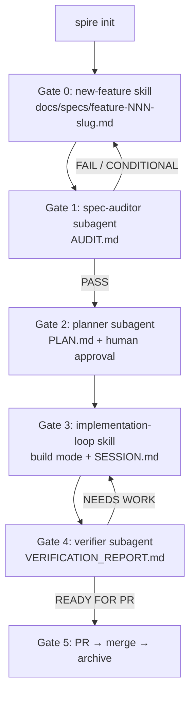

# Spire

`spire` bootstraps and maintains a Spec-Driven Development workflow in your repository using OpenCode's built-in `plan` and `build` modes.

It enforces two reliability layers:
- **Spec Quality** — no work begins against an ambiguous spec (Gate 1 audit before any code)
- **Session Continuity** — feature-scoped `SESSION.md` so multi-session work never drifts

## Install

```bash
curl -fsSL https://raw.githubusercontent.com/niparis/spire/main/scripts/install.sh | bash
```

Supported targets: macOS Apple Silicon (`darwin/arm64`), Windows Intel x64 (`windows/amd64`).

## How to Use

### 1. Bootstrap (once per repo, from the shell)

```bash
spire init
```

This installs the methodology payload under `.methodology/` and projects root files (`AGENTS.md`, `opencode.json`).

### 2. Establish Foundations (if missing)

Open OpenCode in `plan` mode. The agent blocks feature work until both foundation docs exist:

- `docs/specs/PRODUCT.md` — use the `product-definition` skill
- `docs/architecture/ARCHITECTURE.md` — use the `architecture-definition` skill

### 3. Feature Loop (Gates 0–5, all inside OpenCode)

**Gate 0 — Spec authoring** (`plan` mode, `new-feature` skill)
Scaffolds `docs/specs/feature-NNN-<slug>.md` and `docs/changes/NNN-<slug>/`, then interviews you until the spec is complete.

**Gate 1 — Spec audit** (`spec-auditor` subagent)
Scores the spec /50 → `AUDIT.md`. Proceed only on `PASS (≥ 40)`. `CONDITIONAL` blocks until resolved; `FAIL` means rewrite.

**Gate 2 — Planning** (`planner` subagent, from `plan` mode)
Produces a single `PLAN.md` with the chosen approach and ordered task list. Review and explicitly approve before implementation starts.

**Gate 3 — Implementation loop** (`build` mode, `implementation-loop` skill)
Per task: write failing test → implement → lint/typecheck/tests → commit. Keep `SESSION.md` current after each task and at session end. SC-3 circuit-breaker halts after 3 identical failures.

**Gate 4 — Verification** (`verifier` subagent)
Gap analysis against the spec → `VERIFICATION_REPORT.md` with traceability matrix and verdict. `NEEDS WORK` returns to Gate 3.

**Gate 5 — PR & merge**
Open a PR only when the verdict is `READY FOR PR`. Reference the spec, `PLAN.md`, and `VERIFICATION_REPORT.md`. After merge, move `docs/changes/NNN-<slug>/` → `docs/archive/NNN-<slug>/`.



## Command Reference

| Command | What it does |
|---|---|
| `spire init` | Downloads methodology, syncs `.methodology/`, projects root files |
| `spire update` | Refreshes `.methodology/` payload; use `--force` to overwrite protected root files |
| `spire upgrade` | Upgrades the `spire` binary to the latest GitHub release |

The `spire` binary is for bootstrap/maintenance only. All feature work runs inside OpenCode.

## File Layout

```
docs/
  specs/PRODUCT.md                     # product vision (foundation)
  architecture/ARCHITECTURE.md         # tech architecture (foundation)
  specs/feature-NNN-<slug>.md          # feature spec (Gate 0)
  changes/NNN-<slug>/
    AUDIT.md                           # spec audit verdict (Gate 1)
    PLAN.md                            # approach + ordered tasks (Gate 2)
    SESSION.md                         # live continuity (Gate 3)
    VERIFICATION_REPORT.md             # verifier output (Gate 4)
  archive/NNN-<slug>/                  # completed features (Gate 5)
.methodology/                          # methodology payload (managed by spire)
```

## Troubleshooting

- **`Run spire init first`** — initialize the repo before running `update` or starting feature flows.
- **`spire` not found after install** — add the install directory to your `PATH`.
- **`spire update` blocked** — stash or revert local `.methodology/` changes first.
- **Protected root file not updated** — run `spire update --force`.
