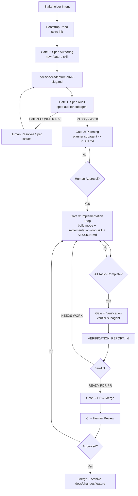

# Spire

`spire` bootstraps and maintains a Spec-Driven Development workflow in your repository.

It operationalizes two reliability layers from the product spec:
- Spec Quality (gate spec clarity before planning/implementation)
- Session Continuity (feature-scoped session state, no context drift)

## Why The Name "Spire"

We chose `Spire` because it feels intentional and architectural: a high point built
on strong structure, which matches this tool's goal (precise specs -> reliable delivery).

- Short and memorable for CLI use (`spire init`, `spire update`, `spire upgrade`).
- Signals quality and precision instead of a temporary codename.
- Fits the product positioning: premium developer experience for agentic workflows.

## Install

```bash
curl -fsSL https://raw.githubusercontent.com/niparis/spire/main/scripts/install.sh | bash
```

Supported installer targets:
- macOS Apple Silicon (`darwin/arm64`)
- Windows Intel x64 (`windows/amd64`, manual binary usage)

## Workflow in 60 Seconds

1. Initialize the methodology once, from the shell:
   ```bash
   spire init
   ```
2. Everything else happens inside OpenCode — no CLI calls mid-loop:
   - In `plan` mode: the `new-feature` skill scaffolds the spec, the
     `spec-auditor` subagent audits it, then the `planner` subagent writes `PLAN.md`.
   - In `build` mode: the `implementation-loop` skill drives TDD; the `verifier`
     subagent produces the verification report.
3. Open a PR only when the verifier verdict is `READY FOR PR`.

## Developer Workflow

1. Bootstrap once per repository with `spire init` (shell).
2. Establish the foundations if missing: in `plan` mode the agent blocks feature
   work until `docs/specs/PRODUCT.md` exists (use the `product-definition` and
   `architecture-definition` skills).
3. Start a feature with the `new-feature` skill (Gate 0) and complete the spec.
4. Dispatch the `spec-auditor` subagent (Gate 1); proceed only on `PASS`.
5. Dispatch the `planner` subagent (Gate 2); review and approve the single `PLAN.md`.
6. Switch to `build` mode and run the `implementation-loop` skill (Gate 3),
   keeping `docs/changes/<feature>/SESSION.md` current.
7. Dispatch the `verifier` subagent (Gate 4) to produce `VERIFICATION_REPORT.md`.
8. Open a PR only on `READY FOR PR`; merge after CI + human review, then archive.

The `spire` binary is for bootstrap/maintenance only (`init`, `update`,
`upgrade`). All feature work stays inside OpenCode via built-in `plan`/`build`
modes, skills, and subagents — there are no custom primary agents.

## Full Gate Flow

1. **Bootstrap (shell)**
   - `spire init` once to install the methodology under `.methodology/`.
   - `spire update` to pull the latest methodology payload.

2. **Gate 0 - Spec Authoring** — `new-feature` skill (`plan` mode)
   - Scaffolds `docs/specs/feature-NNN-<slug>.md` and `docs/changes/NNN-<slug>/`.
   - Interview the user until the spec is complete (goal, journeys, acceptance
     criteria, NFRs, out-of-scope, open questions resolved).

3. **Gate 1 - Spec Audit** — `spec-auditor` subagent
   - Independently scores the spec /50 and writes `docs/changes/<feature>/AUDIT.md`.
   - On `FAIL`/`CONDITIONAL`, resolve and re-audit. Proceed only on `PASS`.

4. **Gate 2 - Planning** — `planner` subagent (from `plan` mode)
   - Writes a single `docs/changes/<feature>/PLAN.md` (approach + ordered tasks).
   - Human reviews and explicitly approves before implementation starts.

5. **Gate 3 - Implementation Loop** — `implementation-loop` skill (`build` mode)
   - Per task: write failing test, implement, run lint/typecheck/tests, then commit.
   - Keep `docs/changes/<feature>/SESSION.md` updated after each task and at
     session end. The SC-3 circuit-breaker stops after 3 identical failures.

6. **Gate 4 - Verification** — `verifier` subagent
   - Gap analysis (behaviour vs spec) → `docs/changes/<feature>/VERIFICATION_REPORT.md`
     with traceability, command evidence, and verdict. Default is the subagent;
     escalate to a separate session for high-risk features.
   - If verdict is `NEEDS WORK`, return to Gate 3.

7. **Gate 5 - PR and Merge**
   - Open a PR only when the Gate 4 verdict is `READY FOR PR`.
   - Include references to spec, plan, and verification report.
   - Merge after CI + human review, then move `docs/changes/<feature>/` to
     `docs/archive/<feature>/`.

## Workflow Diagram



## Command Reference

| Command | Behavior |
|---|---|
| `spire init` | Downloads methodology from the canonical Spire GitHub source, syncs it into `.methodology/`, applies root projections via manifest (for example, `AGENTS.md`), and avoids overwriting existing root files |
| `spire update` | Detects local edits in `.methodology/`, prompts in interactive mode, safely aborts in non-interactive mode, refreshes payload using `.methodology/.spire-source.json` (with canonical fallback), and reports protected-file notices. Use `spire update --force` to overwrite protected project-root projections such as `opencode.json` from the current methodology payload |
| `spire upgrade` | Checks GitHub Releases for a newer `spire` version and replaces the current executable only when a newer release is available |

## File Model

- `.methodology/` is the synced methodology payload managed by `spire` (agent
  prompts, skills, subagent definitions, templates).
- `.methodology/project_root/manifest.json` controls which files are projected to repository root.
- `opencode.json` holds shared OpenCode instructions. Work runs in the built-in
  `plan` and `build` modes; subagent definitions are projected to
  `.opencode/agents/*.md`; skills live under `.methodology/skills/`. There are no
  custom primary agents.
- `.methodology/.spire-source.json` stores where methodology was fetched from for deterministic updates.
- Canonical session continuity file is always `docs/changes/[feature]/SESSION.md`.

`spire init` and `spire update` do not require `SPIRE_METHODOLOGY_SOURCE`.

## Versioning and Distribution

- Tags follow `vX.Y.Z` and trigger release builds.
- Release assets are published to GitHub Releases for supported targets.
- Installer defaults to latest release unless overridden via installer env vars.

## Troubleshooting

- `Run spire init first.`: initialize the repository before `update`/feature flows.
- Installer succeeded but `spire` not found: add install directory to your `PATH`.
- `spire update` blocked by local edits: stash or revert local `.methodology/` changes first.
- Protected root file kept during update: rerun `spire update --force` to replace protected projections such as `opencode.json` with the versions from `.methodology/`.

## Verification Independence

- Default: the `verifier` subagent runs in an isolated context, which keeps the
  verdict independent of the implementation run without leaving OpenCode.
- Escalate to a fully separate OpenCode session for high-risk or large features.
- Minimum: the final Gate 4 verdict must not come from the same active
  implementation run.
- Never open a PR when `VERIFICATION_REPORT.md` verdict is `NEEDS WORK`.

## Related Docs

- `docs/specs/PRODUCT.md`
