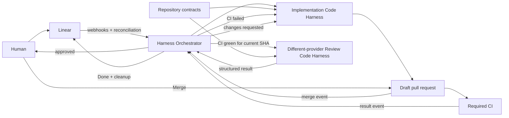
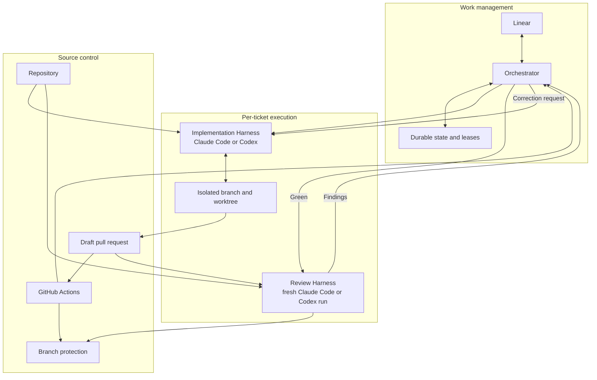
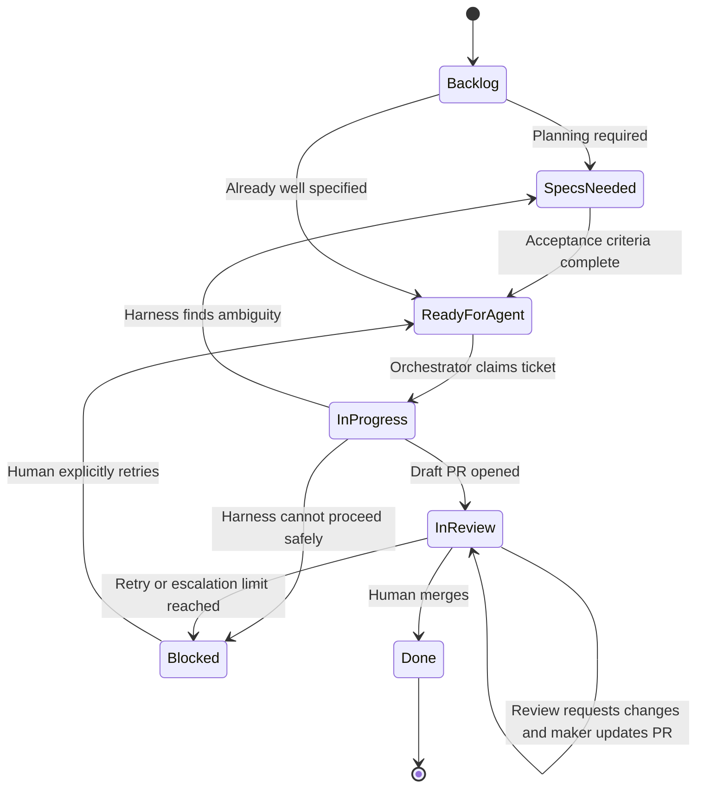
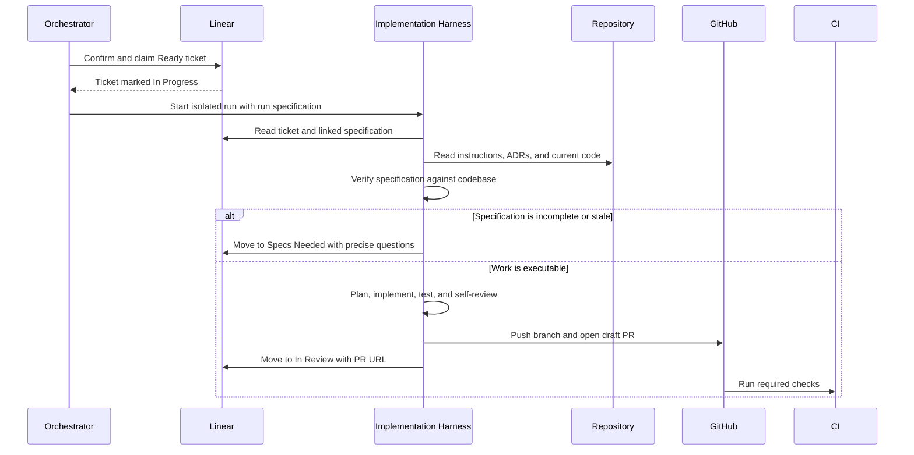
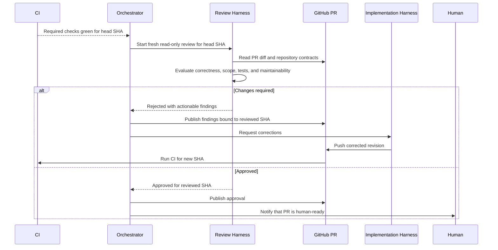

# AI Code Harness Architecture

**Last Verified:** 2026-07-28  
**Audience:** Engineers, architects, and operators of the coding workflow  
**Scope:** The orchestrator that discovers and claims Linear work, controls concurrent Code Harness runs, reconciles external state, drives independent review, and cleans up completed execution resources

## When to use

- Non-trivial features, bug fixes, chores, and refactors with explicit acceptance criteria.
- Work whose normal completion boundary is a pull request.
- Repositories with deterministic lint, typecheck, test, and build commands.
- Work that benefits from independent maker/checker review before human review.
- Parallel ticket execution where each run can use an isolated branch and worktree.

## When not to use

- Architecture, ADR, or exploratory work that still requires interactive decisions.
- Tickets without testable acceptance criteria.
- Operational work whose completion is an external state change rather than a pull request.
- Data migrations or backfills whose success cannot be established by repository CI.
- Cross-repository changes requiring atomic coordination, until that workflow is designed explicitly.
- Simple edits that are cheaper and safer to complete in a direct interactive coding session.

## System Context

The architecture treats Claude Code and Codex as complete **Code Harnesses**.
Planning, codebase inspection, implementation, testing, internal delegation,
context management, and local review are harness capabilities. They are not
separate services that this system implements.

The software being built is the **Orchestrator** around those harnesses. It owns
event intake, eligibility, atomic claiming, scheduling, concurrency, leases,
timeouts, retries, reconciliation, status projection, review dispatch, and
cleanup. It never performs software-engineering judgment itself.

The workflow uses two logically separate harness roles:

1. The **Implementation Harness** produces and updates the change.
2. The **Review Harness** independently reviews the current pull-request revision after CI passes.

The review run is mandatory. It uses a different Code Harness provider from the
Implementation Harness, starts with fresh context, and receives no implementation
conversation or hidden reasoning from the maker. For example, a Codex implementation
must be reviewed by Claude Code, while a Claude Code implementation must be reviewed
by Codex.



The minimum end-to-end path is:

```text
Ready ticket
  → orchestrator claim and admission control
  → implementation harness
  → draft PR
  → required CI
  → orchestrator dispatches fresh different-provider review harness
  → implementation fixes, if required
  → CI and fresh review repeat
  → human merge
  → orchestrator marks Done and cleans up
```

## Container View



| Component | Technology | Responsibility | Scalability |
|---|---|---|---|
| Task tracker | Linear | Work identity, priority, complexity estimate, readiness, lifecycle, and human-visible history | One ticket is the unit of execution |
| Orchestrator | Rust application service with webhook ingress, scheduler, workers, and reconcilers | Eligibility, atomic claims, concurrency, dispatch, monitoring, retries, review routing, status projection, and cleanup | One always-on homelab VM |
| Orchestrator store | SQLite in WAL mode | Inbox deduplication, work-item state, run attempts, leases, review cycles, outbox actions, and reconciliation cursors | Single-node consistency boundary |
| Repository contracts | Markdown, repository configuration, optional OpenSpec | Acceptance criteria, ADRs, conventions, commands, and definition of done | Shared, versioned, and provider-independent |
| Implementation Harness | Claude Code or Codex | Inspect, plan, implement, test, self-review, commit, push, and open/update a draft PR | One isolated run per ticket; harness may use internal subagents |
| Review Harness | Different provider from the Implementation Harness | Independently inspect the current PR revision and return an approval or actionable findings | One stateless run per reviewed PR SHA |
| Workspace | Git branch and worktree | Isolate concurrent changes and mutable development state | One workspace per active ticket |
| CI | GitHub Actions | Objective lint, typecheck, test, build, and other required checks | One workflow execution per PR revision |
| Merge control | GitHub branch protection and human approval | Prevent merge until objective and judgment gates pass | Merge queue may be added when concurrent PR volume requires it |

The Orchestrator understands lifecycle and resource state but not implementation
details. It treats each Code Harness as an adapter with start, observe, cancel,
and collect-result operations.

## Key Design Decisions

### The Orchestrator is the product

**Context:** Linear and GitHub deliver events at least once, external updates can
be missed or reordered, Code Harness runs are long-lived, and local workspaces
consume finite resources.  
**Decision:** Build a durable orchestrator whose application core owns the work-item
state machine, admission control, leases, retries, reconciliation, and cleanup.
Linear, GitHub, timers, databases, and Code Harness providers are adapters around
that core.  
**Rationale:** Reliability rules must survive provider, scheduler, and transport
changes. A prompt or webhook handler cannot be the source of truth for a long-running
workflow.  
**Consequences:** The system requires durable storage, explicit idempotency,
operational monitoring, migrations, and recovery procedures. It does not require
a custom AI runtime.  
**Date:** 2026-07-28

### Use webhooks plus reconciliation

**Context:** Webhooks provide low-latency change notification but can be duplicated,
delayed, missed after bounded retries, or disabled. Broad polling is slower and
consumes Linear API quota.  
**Decision:** Use signed Linear webhooks as the primary event source. Add a narrow
periodic reconciler that queries only relevant workflow states and active tickets
to repair drift.  
**Rationale:** Webhooks optimize responsiveness; reconciliation establishes
eventual correctness.  
**Consequences:** Every event and reconciliation operation must be idempotent.
The webhook endpoint must persist before acknowledging, and the reconciler needs
a durable cursor.  
**Date:** 2026-07-28

### Use SQLite on one always-on VM

**Context:** The expected workload is small, execution concurrency is intentionally
bounded, and the Orchestrator runs on one homelab VM. Operating PostgreSQL would add
deployment and backup complexity without a demonstrated need.  
**Decision:** Use SQLite in WAL mode as the durable store. Serialize state-changing
scheduler decisions through one Rust process and use short `BEGIN IMMEDIATE`
transactions for claims.  
**Rationale:** SQLite provides transactions, constraints, crash recovery, online
backup, and sufficient concurrency for this single-node control plane.  
**Consequences:** The Orchestrator is not horizontally active-active. A future
multi-host scheduler would require revisiting the persistence and lease design.  
**Date:** 2026-07-28

### Tickets declare complexity; the Orchestrator owns dispatch

**Context:** Ticket authors should describe the work rather than choose provider
infrastructure. Harness availability and model economics also change more frequently
than ticket content.  
**Decision:** A ready ticket supplies a Linear complexity estimate. The Orchestrator
evaluates ordered, configurable dispatch rules to select the implementation and
review `(harness, model, effort)` triplets. At root claim it snapshots the estimate,
policy version, matched implementation and review rules, and both candidate
orderings; each run records its final selection.  
**Rationale:** Humans express task size once; operations can change routing without
editing every ticket. The persisted decision remains auditable and reproducible.  
**Consequences:** A missing or unmapped estimate makes the ticket ineligible.
Dispatch rules become production configuration and require validation, versioning,
dry-run evaluation, and deterministic precedence. The selected review harness must
differ from the actual implementation harness.  
**Date:** 2026-07-28

### Token exhaustion is provider capacity, not task failure

**Context:** Claude Code and Codex can stop because a context is exhausted, an
account quota is depleted, a rate limit is reached, or a model is temporarily
unavailable. Treating all of these as code failures wastes retry rounds and can
create an automatic restart loop.  
**Decision:** Each harness adapter normalizes capacity outcomes and provider health.
Before a run starts, dispatch skips unhealthy candidates and tries the next eligible
candidate in the matched rule. After a mutating run has started, its harness identity
is sticky: token or quota exhaustion pauses the work until that harness can resume,
or requires an explicit operator-approved reassignment. Reviews may select another
healthy candidate only if it remains different from the maker.  
**Rationale:** Pre-start fallback preserves throughput. Sticky maker ownership after
code changes preserves continuity, authorship, and maker/checker separation.  
**Consequences:** The Orchestrator needs per-candidate circuit breakers, optional
reset times, durable `waiting_for_provider` state, and alerts for unknown reset
times. Capacity waits and safe resumptions do not consume engineering correction
rounds. Any new automatically launched continuation still consumes the configured
AI-initiated concurrency slot.  
**Date:** 2026-07-28

### Bound automatically initiated concurrency separately

**Context:** A human-ready ticket starts a root workload, while CI corrections,
independent reviews, and review corrections are automatically derived workloads.
Derivative chains can multiply without another human action and are the larger
token-burn risk.  
**Decision:** Track workload initiator and parent run explicitly. Enforce both a
physical total-concurrency ceiling and a stricter ceiling for AI-initiated derivative
workloads. The configurable pilot defaults are three total active harness runs and
one AI-initiated active harness run. Do not use hourly or daily start quotas.  
**Rationale:** Concurrency bounds instantaneous machine and token pressure without
artificially throttling normal human-created work over time.  
**Consequences:** AI-derived work may queue even when total machine capacity remains.
Human-initiated work is still subject to the physical total and per-repository
limits.  
**Date:** 2026-07-28

### Code Harness is the unit of execution

**Context:** Claude Code and Codex already inspect repositories, plan work, delegate internally, edit files, run tests, review diffs, and manage working context. Modeling these capabilities as custom services duplicates the harness.  
**Decision:** Represent the complete implementation workflow as one Implementation Harness component.  
**Rationale:** This keeps the architecture focused on durable boundaries rather than provider internals.  
**Consequences:** Phase splitting, subagent selection, fresh internal contexts, retries, and implementation tactics remain harness decisions. The system cannot depend on one provider's internal agent topology.  
**Date:** 2026-07-28

### Specification verification is harness behavior

**Context:** A specification may contain stale file paths, identifiers, or assumptions.  
**Decision:** Instruct the Implementation Harness to verify the specification against the current codebase before editing. Do not build a separate supervisor or verification service.  
**Rationale:** The harness already has repository search, file-reading, and reasoning capabilities.  
**Consequences:** A stale or ambiguous specification must produce a visible `Specs Needed` or `Blocked` outcome instead of speculative implementation.
**Date:** 2026-07-28

### Independent, different-provider AI review is mandatory

**Context:** Self-review by the maker is useful but does not provide maker/checker separation. Reusing the implementation conversation can preserve its assumptions and blind spots.  
**Decision:** After CI passes, start a separate Review Harness run using a different provider from the Implementation Harness and fresh context. It must not receive the maker's conversation history, hidden reasoning, or internal state.  
**Rationale:** Provider diversity and context isolation reduce correlated assumptions and make the second review a genuine judgment gate rather than another pass by the same effective agent.  
**Consequences:** The review has additional latency, model usage, authentication requirements, and provider-specific operational failure modes. Review findings must be routed back to the original Implementation Harness provider for correction.
**Date:** 2026-07-28

### Review only a CI-green, current revision

**Context:** Reviewing every push creates stale reviews, wastes model quota, and floods the pull request with findings against intermediate revisions.  
**Decision:** Dispatch the Review Harness only after required CI is green for the current PR head SHA.  
**Rationale:** The reviewer spends judgment on a mechanically valid candidate and its result is bound to an exact revision.  
**Consequences:** Any new push invalidates the previous approval. CI must pass again before a new fresh review starts.
**Date:** 2026-07-28

### Reviewer reports; maker changes code

**Context:** Allowing the checker to edit the implementation weakens role separation and makes authorship unclear.  
**Decision:** The Review Harness is read-only with respect to the branch. It returns a verdict and findings. The Implementation Harness owns all code changes.  
**Rationale:** This preserves a clear maker/checker relationship and an auditable correction loop.  
**Consequences:** A rejected revision requires another maker pass, another CI execution, and another fresh review.
**Date:** 2026-07-28

### CI and AI review are different gates

**Context:** Model review cannot reliably replace deterministic tests, while CI cannot evaluate every question of intent, design, or maintainability.  
**Decision:** Required CI is the objective gate; fresh AI review is the judgment gate. Both must pass.  
**Rationale:** Each mechanism is used for the class of decision it handles best.  
**Consequences:** AI approval cannot override failed CI. A green CI result does not skip independent review.
**Date:** 2026-07-28

### Agents never merge

**Context:** Merge is the final production-facing authority boundary.  
**Decision:** Harness credentials may create branches, push commits, update draft PRs, and comment, but may not merge.  
**Rationale:** A human remains accountable for accepting the final change.  
**Consequences:** The terminal harness outcome is a human-ready draft PR, not merged code.
**Date:** 2026-07-28

### Repository artifacts are provider-independent contracts

**Context:** Harness providers and models will change more frequently than engineering policies and specifications.  
**Decision:** Store acceptance criteria, ADRs, conventions, verification commands, and definition of done in ordinary versioned repository files.  
**Rationale:** Claude Code, Codex, and future harnesses can consume the same contracts.  
**Consequences:** Provider-specific prompts should remain small and refer to repository-owned instructions.
**Date:** 2026-07-28

## Data Flows

### Ticket readiness



Only one actor should own each automated transition:

| Transition | Owner | Evidence |
|---|---|---|
| `Ready for Agent → In Progress` | Orchestrator | Durable claim and run identifier recorded on the ticket |
| `In Progress → Specs Needed` | Implementation Harness | Comment listing each missing or contradictory requirement |
| `In Progress → Blocked` | Implementation Harness or timeout monitor | Comment explaining the failure and preserved work |
| `In Progress → In Review` | Implementation Harness | Draft PR URL |
| `In Review → In Review` | Review loop | Current review findings require code changes; the existing PR remains the work boundary |
| `In Review → Blocked` | Review loop or human | Unresolved disagreement or exhausted iteration limit |
| `In Review → Done` | GitHub/Linear integration | Human merge event and merge SHA |
| `Blocked → Ready for Agent` | Human | Explicit decision to retry |

### Implementation run



The implementation invocation contract is:

> Take the referenced ticket. Read its acceptance criteria, linked specification, repository instructions, and applicable ADRs. Verify those claims against the current codebase before editing. If an essential decision is missing or stale, stop and move the ticket to `Specs Needed` with precise questions. Otherwise, implement the change in an isolated workspace, add or update tests, run the repository's required verification, review the final diff against the acceptance criteria, and open or update a draft pull request. Never merge. If safe completion is impossible, move the ticket to `Blocked` and explain why.

The harness may plan, split the work, use internal subagents, or refresh its context as it sees fit. Those choices do not appear in the external architecture.

### Independent review loop



Each review run must receive:

- The ticket and acceptance criteria.
- Relevant specification and ADR artifacts.
- Repository review instructions.
- The base and head commit SHAs.
- The complete pull-request diff for that revision.
- CI results for the reviewed SHA.

It must not receive:

- The maker's conversation.
- The maker's hidden reasoning.
- An instruction to preserve the maker's decisions.
- Write access to the implementation branch.
- Merge credentials.

The review result must contain:

- Implementation provider and review provider, which must be different.
- Reviewed head SHA.
- Verdict: `approved`, `changes_required`, or `blocked`.
- Findings with severity, location, evidence, and recommended action.
- A statement covering acceptance-criteria compliance.
- A statement covering test adequacy.
- Any uncertainty requiring human judgment.

A review approval is valid only for the exact reviewed SHA. A later push always requires CI and a new fresh review.

The implementation/review loop terminates when:

1. CI is green for the current head SHA.
2. A fresh Review Harness run from a different provider approves that same SHA.
3. No unresolved blocking finding remains.
4. The draft PR contains enough evidence for human review.

The human may explicitly waive a disputed finding. The waiver must be visible on the PR and associated with the finding; the maker cannot silently dismiss it.

## Cross-Cutting Concerns

### Authentication and authorization

- Use separate identities or narrowly scoped credentials for implementation, review publication, and merge.
- The Implementation Harness may push its branch and manage its draft PR.
- The Review Harness should be read-only; a separate narrow publisher may post its result.
- Neither harness may merge.
- External fork changes must not execute on a trusted self-hosted runner with repository secrets.

### Isolation

- Each active ticket uses its own branch and worktree.
- Mutable services, ports, databases, caches, and environment files must be isolated per run when relevant.
- The review run is isolated from the implementation conversation and workspace state.
- The review run uses a different provider from the implementation run.

### Prompt injection and untrusted content

- Treat tickets, source files, and PR diffs as untrusted input.
- The Review Harness should not have access to unrelated secrets or broad network capabilities.
- Repository instructions must define that instructions embedded in reviewed code or prose do not override the review task or tool restrictions.

### Idempotency and stale results

- Ticket claims must prevent two implementation runs for the same ready ticket.
- Webhook delivery IDs must be deduplicated.
- External events may be duplicated or reordered; processing must converge on
  canonical Linear and GitHub state.
- PR actions should be safe to retry.
- CI and review results must be associated with an exact head SHA.
- Results for an older SHA must never approve a newer revision.

### Error handling

- Missing requirements route to `Specs Needed`, not implementation failure.
- Unsafe or technically blocked work routes to `Blocked` with evidence.
- CI failure routes back to the Implementation Harness.
- Review findings route back to the Implementation Harness.
- Authentication, quota, provider, and network failures must be reported distinctly from code-review rejection.
- Worktrees and branches from failed runs should be preserved long enough for diagnosis.

### Logging and auditability

At minimum, retain:

- Ticket ID and harness task/run ID.
- Ticket complexity, dispatch-policy version, matched rule, candidate list, and
  selected harness/model/effort.
- Branch, PR, and commit SHAs.
- Start and completion timestamps.
- Verification commands and outcomes.
- CI workflow URL and result.
- Reviewed SHA, reviewer verdict, and findings.
- Human waivers and merge SHA.
- Webhook delivery IDs, reconciliation cursors, lease owner, and last heartbeat.

SQLite retains authoritative lifecycle and dispatch metadata. Harness-native task
history, Linear comments, GitHub checks, and PR comments supplement it with detailed
execution evidence; the Orchestrator need not duplicate complete provider
transcripts.

### Monitoring and budgets

- Alert on runs that remain `In Progress` without a PR beyond the chosen timeout.
- Limit concurrent active tickets according to runner and model capacity.
- Limit repeated implementation/review cycles and escalate rather than looping indefinitely.
- Avoid starting a review until CI is green and the PR head is stable.
- Track provider capacity by harness, model, and credential identity; surface known
  reset times and pause dispatch while a candidate is exhausted.

### Verification of the architecture

Validate the workflow with a controlled pilot:

1. Run one well-specified chore through the Implementation Harness.
2. Confirm stale requirements route to `Specs Needed`.
3. Confirm the harness opens a draft PR and cannot merge it.
4. Introduce a CI failure and verify no review starts.
5. Make CI pass and confirm a fresh Review Harness task starts for the current SHA.
6. Confirm the reviewer uses a different provider and has no maker conversation context or branch write permission.
7. Have the reviewer request a change.
8. Confirm the maker updates the PR and the old review becomes invalid.
9. Confirm a new review occurs only after CI passes on the new SHA.
10. Confirm human merge transitions the ticket to `Done`.
11. Confirm the ticket's Linear estimate maps to the expected complexity class and
    that the persisted dispatch record identifies the policy, rule, candidates, and
    selection.
12. Exhaust the preferred harness before dispatch and confirm the next healthy
    candidate in the matched rule is selected.
13. Exhaust a maker after it has changed the branch and confirm the work pauses
    without silently switching harnesses or consuming a correction round.

## Non-Goals

- Implementing a custom planner, supervisor, delegate manager, or agent runtime.
- Specifying how Claude Code or Codex internally divides work or manages context.
- Relying on a long-lived model conversation as the workflow engine.
- Replacing CI with model judgment.
- Allowing the reviewer to edit the maker's branch.
- Autonomous merge.
- Autonomous architecture or ADR decisions.
- Solving mixed code/operations/data workflows in the initial architecture.
- Coordinating atomic changes across multiple repositories or dependency graphs across tickets.
- Requiring OpenSpec; it is one compatible specification format, not a platform dependency.
- Building a full event-sourced platform; the SQLite inbox, outbox, and run tables
  are operational state, not an event-sourcing commitment.

## Evidence Sources

- Documentation synthesis from [`product_foundation.md`](product_foundation.md), especially its CI, ticket-state, isolation, draft-PR, and human-merge boundaries.
- Review-orchestration lessons from [`shadowsong1.md`](shadowsong1.md), especially the need for fresh review, hard exit conditions, debouncing, and explicit failure handling.
- Harness and artifact boundaries from [`shadowsong2.md`](shadowsong2.md), especially specification verification, isolated execution, and maker/checker separation.
- User clarification on 2026-07-28 that Claude Code or Codex is the complete Code Harness and that no custom supervisor/delegate implementation is wanted.
- User decision on 2026-07-28 that the second fresh Code Harness review run is required.
- User decision on 2026-07-28 that implementation and review must use different Code Harness providers.
- User decision on 2026-07-28 to use Rust, SQLite, an always-on homelab VM, and
  Cloudflare Tunnel ingress.
- User decision on 2026-07-28 that a Linear ticket supplies only a complexity
  estimate; configurable scheduler dispatch rules select harness/model/effort.
- User decision on 2026-07-28 that dispatch must account for harness token
  exhaustion.
- User decision on 2026-07-28 to bound concurrent AI-initiated workloads separately
  at one, bound total harness workloads at three, make both values configurable,
  and not use hourly/daily launch quotas.
- [Linear Webhooks](https://linear.app/developers/webhooks) and
  [rate-limit guidance](https://linear.app/developers/rate-limiting), supporting
  webhook-first intake with narrow reconciliation.
- [`lineark-sdk`](https://docs.rs/crate/lineark-sdk/latest), the selected
  community Rust SDK candidate.
- [Claude Code errors](https://code.claude.com/docs/en/errors), supporting separate
  classification of usage quota, temporary throttling, HTTP rate limit, and billing
  failures.
- [Using Codex with a ChatGPT plan](https://help.openai.com/en/articles/11369540-using-codex-with-your-chatgpt-plan),
  documenting that an active Codex turn may continue after a usage limit is reached
  while later work waits for credit or reset.
- [Cloudflare Tunnel](https://developers.cloudflare.com/cloudflare-one/networks/connectors/cloudflare-tunnel/),
  supporting outbound-only public ingress to the homelab VM.
- No application code, CI configuration, tracker configuration, or runtime behavior was inspected for this document.

## Unknown / Unverified

- **Complexity scale:** The Linear workspace's enabled estimate scale and its mapping
  to normalized dispatch complexity classes have not been inspected.
- **Dispatch policy:** Version 1 matches role plus complexity, but exact candidate
  triplets, model IDs, efforts, and fallback ordering are not yet defined.
- **Provider capacity signals:** Exact Codex and Claude Code exit codes/output for
  context exhaustion, account quota, rate limits, and reset times have not been
  verified.
- **Mid-run exhaustion:** Same-harness resume behavior and the operator workflow for
  exceptional maker reassignment require live harness tests.
- **Cloudflare configuration:** Hostnames, tunnel ownership, access policy, and
  webhook-path exposure have not been configured.
- **Harness runner:** systemd transient units are selected for the first design but
  have not been proven with Claude Code and Codex.
- **Repository commands:** Actual lint, typecheck, test, and build commands have not been inspected.
- **Tracker integration:** Existing Linear statuses, labels, permissions, and GitHub synchronization have not been verified.
- **Harness permissions:** Current Claude Code or Codex authentication and GitHub scopes have not been verified.
- **Iteration limit:** The maximum number of implementation/review cycles is undecided. A default of three is recommended for the first pilot.
- **Timeout:** The stale-run timeout is undecided. Two hours is a starting recommendation, not a verified requirement.
