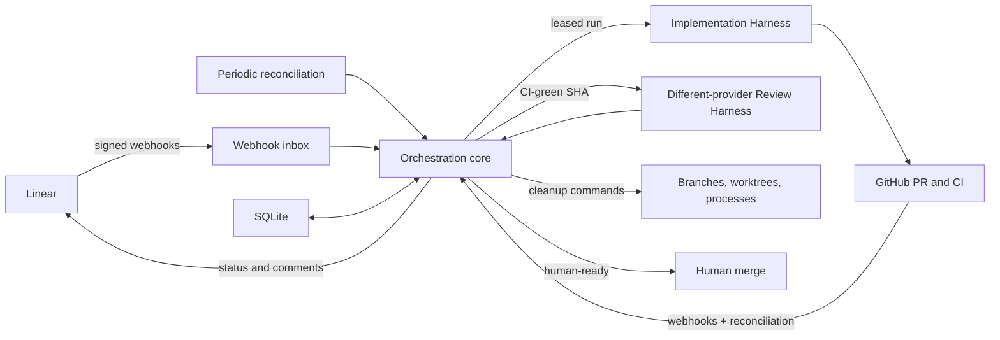
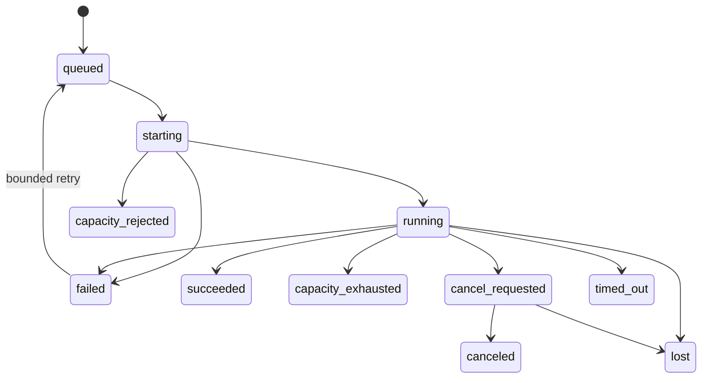
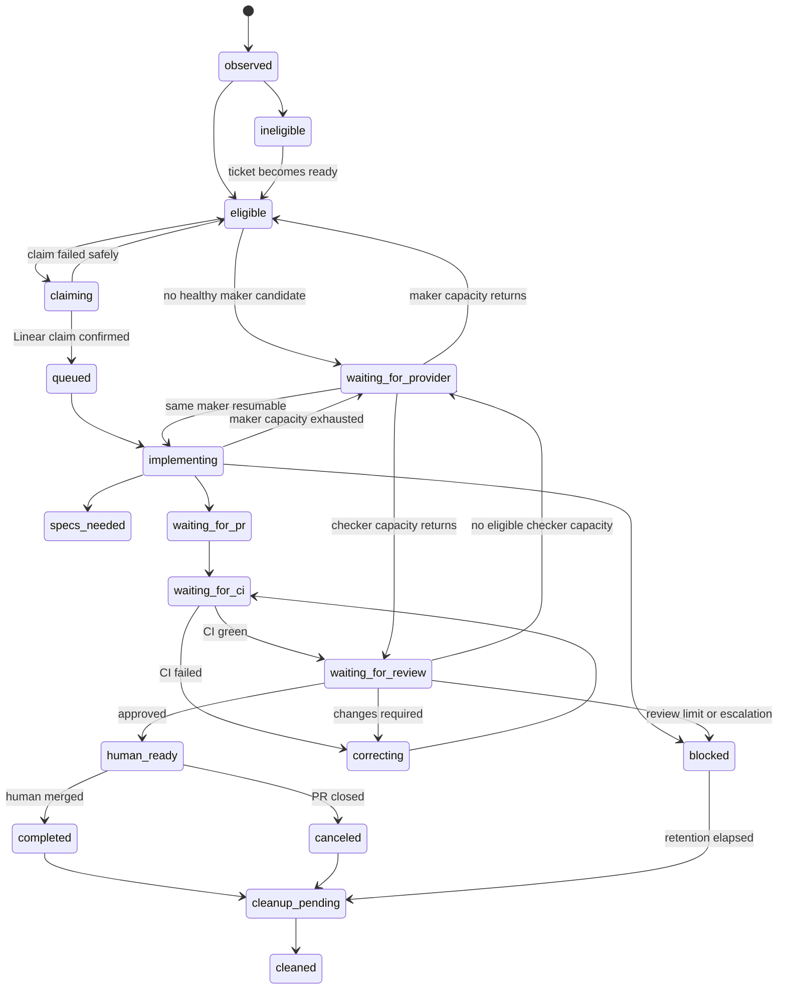

# AI Harness Orchestrator Implementation Design

**Path:** `docs/ai_harness_implementation.md`  
**Last Verified:** 2026-07-29
**Purpose:** Define the software that observes Linear, claims eligible tickets, schedules Code Harness runs, enforces concurrency, coordinates CI and independent review, reconciles missed events, and cleans up terminal runs.

## Overview

The product being built is a durable **AI Harness Orchestrator**.

Claude Code and Codex remain complete Code Harnesses. The Orchestrator does not
reimplement their planning, delegation, code editing, testing, or review behavior.
It decides **when** a harness may run, **which** provider receives the work, **what
state transition** follows, and **how the system recovers** when external events or
runs fail.



### Recommended first implementation

- **Language:** Rust on Tokio.
- **HTTP:** Axum with Tower middleware.
- **Linear client:** `lineark-sdk` behind a replaceable `LinearPort` adapter.
- **State:** SQLite in WAL mode as the execution source of truth.
- **Linear intake:** signed webhooks as the primary path.
- **Correctness repair:** filtered reconciliation every 10 minutes.
- **GitHub intake:** webhooks where available, plus filtered reconciliation for open
  orchestrated PRs.
- **Queue:** SQLite inbox, outbox, and leased work tables; no Redis or separate
  message broker initially.
- **Deployment:** one Rust service on an always-on homelab VM, with `cloudflared`
  providing public HTTPS ingress.
- **Initial physical concurrency:** configurable total and per-repository ceilings.
- **AI-derived concurrency:** a separate, stricter ceiling for workloads spawned
  automatically by CI/review outcomes.
- **Dispatch:** the ticket supplies a complexity estimate; versioned scheduler rules
  select ordered `(harness, model, effort)` candidates for implementation and review.
- **Maker/checker rule:** the selected review harness must differ from the actual
  implementation harness.
- **Provider capacity:** token/quota exhaustion is a schedulable capacity state with
  circuit breakers and reset-aware waiting, not an engineering failure.
- **Merge:** human only.

This is a hybrid event-driven design. It deliberately rejects both extremes:

| Design | Benefit | Failure mode | Decision |
|---|---|---|---|
| Pure polling | Simple ingress and no public webhook endpoint | Latency, unnecessary API usage, rate-limit pressure | Reject |
| Pure webhook | Low latency and low API usage | Missed, duplicated, delayed, or disabled delivery can strand work | Reject |
| Webhook plus reconciliation | Fast normal path and eventual correction | More state and idempotency work | **Adopt** |

Linear explicitly recommends webhooks instead of polling for updates. Its webhook
delivery is bounded, however, so reconciliation is still necessary for an
orchestrator that must recover without human memory.

## When to use

- Building the service that connects Linear, GitHub, Claude Code, and Codex.
- Running multiple unattended tickets with bounded machine and provider capacity.
- Requiring deterministic recovery after crashes, missed events, or provider outages.
- Maintaining a reliable audit trail across ticket, run, PR, CI, review, and cleanup.
- Supporting more than one repository or more than one Code Harness provider.

## When not to use

- As an AI agent runtime or replacement for Claude Code or Codex.
- For a one-off interactive coding session.
- For architecture, ADR, or spike tickets that intentionally require human dialogue.
- For operations or data workflows until their completion semantics are designed.
- As a reason to introduce Temporal, Kafka, Kubernetes, PostgreSQL, or event sourcing
  before the SQLite-backed single-node service reaches operational limits.

## Public API

The Orchestrator exposes inbound HTTP endpoints and defines ports around its
application core. HTTP controllers and provider clients translate data; they do not
contain scheduling or transition rules.

### Inbound HTTP endpoints

#### `POST /webhooks/linear`

Receives Linear webhook deliveries.

Required behavior:

1. Read the raw body without prior JSON reserialization.
2. Verify `Linear-Signature` using HMAC-SHA256.
3. Verify the webhook timestamp is within the accepted replay window.
4. Validate the organization and webhook IDs against the allowlist.
5. Insert the delivery into `webhook_inbox` using `Linear-Delivery` as the unique key.
6. Return `200` after durable insertion, including for an already stored duplicate.
7. Perform no Linear API calls and start no harness process in the request path.

Linear requires a public HTTPS endpoint and treats responses slower than five
seconds as failed. Failed deliveries are retried after approximately one minute,
one hour, and six hours, up to three retries. The handler must therefore acknowledge
quickly after durable storage.

Responses:

| Status | Meaning |
|---|---|
| `200` | Delivery durably accepted or already recorded |
| `400` | Malformed payload |
| `401` | Invalid signature, timestamp, or source identity |
| `503` | Durable inbox unavailable; Linear should retry |

#### `POST /webhooks/github`

Receives the minimum GitHub event set:

- `pull_request`
- `check_run` or `check_suite`
- `workflow_run`
- `push`

The endpoint follows the same durable-inbox rule:

1. Verify the GitHub webhook signature.
2. Deduplicate by GitHub delivery ID.
3. Persist the raw event and selected headers.
4. Return promptly.
5. Resolve canonical PR and check state asynchronously.

Events are delivered by the operator's GitHub App installation, so the event set
is fixed by the App registration manifest rather than by per-repository webhook
configuration. The application core consumes normalized facts rather than raw
GitHub event variants.

#### `POST /admin/reconcile`

Starts a bounded reconciliation pass.

Required authorization: operator only.

Optional parameters:

```json
{
  "scope": "all | linear | github | runs | workspaces",
  "ticket_id": "optional",
  "pull_request": "optional"
}
```

The endpoint creates a reconciliation job and returns immediately. It does not run
the reconciliation inside the HTTP request.

#### `POST /admin/runs/{run_id}/retry`

Explicitly retries a terminal retryable run.

Preconditions:

- No active run exists for the same ticket and role.
- The ticket remains eligible for the requested action.
- The retry limit is not bypassed without an operator reason.
- Any prior lease is expired or released.

#### `POST /admin/runs/{run_id}/cancel`

Requests cancellation, updates the run to `cancel_requested`, and delegates actual
process termination to the configured Harness Runner adapter.

#### `GET /health/live`

Process liveness only. It must not query external systems.

#### `GET /health/ready`

Verifies:

- Database connectivity.
- Required migrations applied.
- Scheduler leadership or worker registration as appropriate.
- Required provider configuration present.
- Complexity mapping, harness registry, and dispatch policy parsed and validated.

External provider outages should appear in detailed diagnostics but should not
necessarily remove the API process from service.

### Application ports

The application core defines these interfaces:

```text
LinearPort
  get_issue(issue_id)
  find_relevant_issues(filter, cursor)
  transition_issue(issue_id, expected_state, target_state)
  post_comment(issue_id, idempotency_key, body)
  get_workflow_configuration(team_id)

GitHubPort
  get_pull_request(repo, number)
  find_pull_request_by_branch(repo, branch)
  get_required_checks(repo, head_sha)
  get_merge_state(repo, number)
  post_review_summary(repo, number, idempotency_key, body)

HarnessRunnerPort
  probe_capacity(profile) -> normalized_capacity
  start(run_spec) -> external_run_id
  inspect(external_run_id) -> status
  resume(run_spec, prior_external_run_id?) -> external_run_id
  cancel(external_run_id)
  collect_result(external_run_id) -> normalized_result

WorkspacePort
  prepare_repository(mapping) -> repository_status
  allocate_maker(work_item_id, root_run_id, base_sha) -> workspace
  allocate_review(review_cycle_id, head_sha) -> workspace
  inspect(workspace_id) -> status
  quarantine(workspace_id, reason)
  cleanup(workspace_id)

ClockPort
  now()

NotifierPort
  notify(channel, severity, subject, body)

UnitOfWork
  transaction()
```

Adapters implement these ports for Linear GraphQL, GitHub, Claude Code, Codex,
local worktrees, process supervision, and notifications.

### Linear ticket complexity contract

The ticket does not choose a harness, model, or effort. A ticket moved to
`Ready for Agent` supplies one Linear complexity estimate. The Orchestrator reads
that canonical estimate and maps it through configuration.

The Linear workspace may use a different numeric estimate scale, so configuration
must map every allowed raw estimate to one stable dispatch class. This example is
illustrative; Milestone 0 must replace it with the workspace's actual scale:

```yaml
linear:
  complexity_mapping:
    1: small
    2: medium
    3: large
    5: xlarge
```

Requirements:

- A Ready ticket must have exactly one supported estimate.
- The raw estimate and normalized class are snapshotted at claim.
- A changed estimate affects a queued retry only after explicit cancellation and
  requeue; it never silently reroutes a running ticket.
- Complexity describes expected work size. It is not priority and does not change
  candidate ordering among tickets.
- Harness/model identifiers never need to appear in Linear.

### Dispatch policy

Dispatch is an ordered, versioned configuration owned by the Orchestrator. Rules
match a workload role and normalized complexity class, then expose an ordered list
of `(harness, model, effort)` candidates.

Version 1 uses only `role` and `complexity` as routing predicates. Repository,
priority, labels, and ticket author do not silently alter model selection. If a
future policy needs another predicate, add it to the schema, bump the policy version,
and persist it in the dispatch audit record.

```yaml
dispatch:
  policy_version: 1
  rules:
    - id: implementation-small
      when:
        role: implementation
        complexity: [small]
      candidates:
        - { harness: codex, model: "<model-id>", effort: medium }
        - { harness: claude-code, model: "<model-id>", effort: medium }

    - id: implementation-large
      when:
        role: implementation
        complexity: [medium, large, xlarge]
      candidates:
        - { harness: codex, model: "<model-id>", effort: high }
        - { harness: claude-code, model: "<model-id>", effort: high }

    - id: review-default
      when:
        role: review
        complexity: [small, medium, large, xlarge]
      candidates:
        - { harness: claude-code, model: "<model-id>", effort: high }
        - { harness: codex, model: "<model-id>", effort: high }
```

The concrete model IDs above are intentionally unresolved. At startup, validation
must prove:

- Every supported role/complexity combination matches exactly one rule.
- Rule IDs are unique and rule precedence is deterministic.
- Every candidate exists in the harness capability registry.
- Every effort value can be translated by the selected adapter.
- Every implementation rule has at least one review candidate using a different
  harness.
- The policy version is explicit and monotonically changed when routing semantics
  change.

At root claim, the scheduler persists the policy version plus the matching
implementation and review rule IDs and both full ordered candidate lists. It also
persists each candidate health decision and the selected maker triplet. When review
becomes eligible, routing uses the snapshotted review candidates—not whatever policy
is current at that later time—and filters out the actual maker harness.

Version 1 does not hot-reload dispatch policy. A policy change is validated with a
CLI dry run that reports how currently eligible tickets would route, then installed
as one configuration file and activated by restarting the systemd service. Startup
fails readiness unless the entire policy validates. Existing work items retain
their persisted plan and active runs recover normally after restart.

### Workload initiation contract

Every Run records why it exists:

```json
{
  "initiator": "human",
  "trigger_kind": "linear_ready",
  "parent_run_id": null,
  "root_run_id": "uuid"
}
```

Allowed initiators:

| Initiator | Meaning | Examples |
|---|---|---|
| `human` | A human explicitly requested a root or retry workload | Ticket moved to Ready, operator retry |
| `ai` | The Orchestrator automatically launches another harness workload after a prior harness attempt or outcome | Independent review, CI correction, review correction, fresh-context continuation |
| `system` | Maintenance work that does not invoke a Code Harness | Reconciliation, cleanup, health audit |

`trigger_kind` values initially include:

```text
linear_ready
operator_retry
ci_failed
review_required
review_changes_requested
provider_capacity_continuation
reconciliation_recovery
```

The `initiator` classification is causal, not a synonym for the selected provider.
A Codex or Claude process may execute either human- or AI-initiated work.

### Harness capacity contract

Each harness adapter must distinguish task outcomes from capacity and integration
failures. Provider-specific text or exit codes are normalized into:

| Classification | Meaning | Scheduler action |
|---|---|---|
| `available` | Candidate may accept work | Eligible for dispatch |
| `rate_limited` | Short provider throttle, with optional retry time | Open candidate circuit until `retry_at` |
| `quota_exhausted` | Credential/account token allowance is depleted | Open candidate circuit until known reset; otherwise require health probe/operator action |
| `context_exhausted` | This run cannot continue in its current context | Ask the same adapter to resume/compact if supported; otherwise create a fresh same-harness continuation on the preserved workspace |
| `output_limit` | One model response reached its output ceiling | Let the harness continue if it can; otherwise use a bounded same-session/same-harness continuation |
| `model_unavailable` | Selected model cannot currently accept work | Skip this candidate before start; open circuit |
| `auth_failed` | Credential or subscription is invalid | Disable candidate and alert |
| `runner_unhealthy` | Local process/systemd execution is unavailable | Stop admission on that runner |
| `unknown_provider_failure` | Adapter cannot safely classify the provider response | Preserve raw evidence, open a short circuit, and alert; do not loop |
| `task_failed` | The harness ran, but could not complete the engineering task | Apply task failure policy |

Circuit-breaker identity is at least `(harness, model, credential_profile)`. A
global provider outage may open multiple circuits, but a single depleted credential
must not unnecessarily disable another credential or model.

Capacity probes are advisory because a provider may not expose remaining tokens and
capacity can change between probe and launch. The authoritative signal is the
adapter's normalized start/run result, so the post-start refusal path remains
required even when probes report healthy.

Known adapter inputs:

- Claude Code programmatic output exposes structured error categories including
  `billing_error`, `rate_limit`, `max_output_tokens`, and `unknown`, plus an HTTP
  status and session ID. Map `max_output_tokens` to `output_limit`, not account
  quota. Its usage-limit messages may include a reset time. Preserve the session ID
  so a same-harness continuation can use its supported resume path.
- Codex `exec` supports JSONL events, explicit model/profile selection, an output
  schema, and session resume. The exact JSONL event emitted for account-credit or
  usage-limit exhaustion is not yet documented in this repository and must be
  captured in adapter contract fixtures.
- A Codex account may allow the active turn to finish after reaching a usage limit
  and block later turns instead. Therefore a limit observation can open the circuit
  for future starts without canceling a still-healthy active process.

Never classify by matching a single human-readable sentence alone. Prefer structured
fields; use versioned message patterns only as a fallback, retain the raw event, and
map unknown errors to `unknown_provider_failure` with an operator alert.

Do not enable a harness's opaque automatic model fallback in the initial release,
even when its CLI offers one. Model fallback belongs in the Orchestrator's ordered
candidate rules so the actual model and reason are auditable. Provider-internal
request retries may remain enabled and count as one harness run; the Orchestrator
acts only after the provider surfaces a final failure.

Dispatch behavior:

1. Before allocating a workspace, walk the matched rule's candidates in order.
2. Skip candidates with an open circuit, unsupported capability, or an explicit
   provider signal that new work is unavailable.
3. Persist why each candidate was skipped.
4. Select the first healthy candidate.
5. If no candidate is healthy, leave the workload in `waiting_for_provider` with
   the earliest known retry time; do not claim physical concurrency.

If `start` returns a recognized capacity refusal before the harness accepts work,
mark that Run `capacity_rejected`, release the provisional slot, open that
candidate's circuit, and create a new Run/dispatch decision for the next candidate.
This is still pre-start fallback. An unknown refusal fails closed and alerts; it
must not cause an unbounded candidate loop.

After the first mutating run starts successfully, the maker harness is sticky for
that work item. A context-exhausted continuation may use a fresh context, and a
model fallback may be allowed only when the dispatch rule explicitly lists it under
the same harness. Switching to a different harness after mutation requires an
operator-approved reassignment because it changes authorship and can invalidate the
planned checker selection.

Reviews are stateless per SHA and may fall through to another healthy review
candidate automatically, provided its harness differs from the sticky maker.
Capacity waits, health probes, and safe same-harness continuations consume
infrastructure retry counts, never CI or review correction counts. A new automatic
harness continuation is a child Run with `initiator = ai` and must acquire both
total and AI-initiated capacity. It may pass the prior provider session ID to
`resume`, but remains a distinct Orchestrator Run for accounting. A still-running
provider task that merely resumes observation does not create a second workload.

### Harness run specification

The Orchestrator starts a harness through a normalized contract:

```json
{
  "schema_version": 1,
  "run_id": "uuid",
  "work_item_id": "uuid",
  "role": "implementation",
  "initiator": "human",
  "trigger_kind": "linear_ready",
  "parent_run_id": null,
  "root_run_id": "uuid",
  "dispatch": {
    "policy_version": 1,
    "rule_id": "implementation-large",
    "candidate_index": 0
  },
  "profile": {
    "harness": "codex",
    "model": "provider-model-id",
    "effort": "high"
  },
  "ticket": {
    "id": "ABC-123",
    "url": "https://linear.app/...",
    "revision": "updated-at-or-content-hash",
    "complexity_estimate": 3,
    "complexity_class": "large"
  },
  "repository": {
    "name": "owner/repository",
    "base_branch": "main",
    "base_sha": "sha",
    "workspace_id": "uuid",
    "workspace_kind": "maker",
    "branch": "spire/abc-123-rootrunsuffix",
    "workspace_path": "/controlled/worktree/path"
  },
  "cycle": 1,
  "pull_request": null,
  "review_result": null,
  "deadline": "timestamp"
}
```

Review runs additionally require:

```json
{
  "role": "review",
  "initiator": "ai",
  "trigger_kind": "review_required",
  "parent_run_id": "implementation-run-uuid",
  "profile": {
    "harness": "claude-code",
    "model": "provider-model-id",
    "effort": "high"
  },
  "sticky_maker_profile": {
    "harness": "codex",
    "model": "provider-model-id",
    "effort": "high"
  },
  "pull_request": {
    "number": 123,
    "base_sha": "sha",
    "head_sha": "sha"
  },
  "repository": {
    "name": "owner/repository",
    "workspace_id": "uuid",
    "workspace_kind": "review",
    "branch": null,
    "workspace_path": "/controlled/review-worktree",
    "head_sha": "sha"
  },
  "ci_evidence": {
    "required_checks": "all successful",
    "workflow_urls": []
  },
  "review_round": 1
}
```

Validation rejects a review run when:

```text
review_harness == sticky_maker_harness
current_pr_head != requested_head_sha
required_ci != successful
review_round > configured_maximum
no healthy different-harness candidate exists
```

### Normalized harness result

```json
{
  "schema_version": 1,
  "run_id": "uuid",
  "role": "implementation",
  "provider": "codex",
  "outcome": "pr_ready",
  "external_run_id": "provider-specific-id",
  "branch": "spire/abc-123-rootrunsuffix",
  "head_sha": "sha",
  "pull_request_url": "https://github.com/owner/repository/pull/123",
  "summary": "Implemented and verified the requested change.",
  "questions": [],
  "blockers": [],
  "review": null
}
```

Implementation outcomes:

```text
pr_ready
specs_needed
blocked
no_change
failed
```

Review outcomes:

```text
approved
changes_required
blocked
failed
```

Provider-specific output is normalized by its adapter before it reaches the
application core.

## Implementation Notes

### Architectural shape

Use a Rust modular monolith with inward dependencies:

```text
crates/
├── spire-domain/
│   └── src/
├── spire-application/
│   └── src/
├── spire-adapters/
│   └── src/
└── spire/
    └── src/

logical modules:
├── domain/
│   ├── work_items/
│   ├── runs/
│   ├── reviews/
│   ├── leases/
│   ├── policies/
│   └── provider_capacity/
├── application/
│   ├── ingest_event/
│   ├── reconcile/
│   ├── schedule_work/
│   ├── start_run/
│   ├── observe_run/
│   ├── handle_ci/
│   ├── handle_review/
│   ├── evaluate_dispatch/
│   ├── refresh_provider_health/
│   └── cleanup/
├── ports/
├── adapters/
│   ├── linear/
│   ├── github/
│   ├── sqlite/
│   ├── claude/
│   ├── codex/
│   ├── process_runner/
│   └── worktree/
├── entrypoints/
│   ├── api/
│   ├── scheduler/
│   └── worker/
└── migrations/
```

The domain and application layers import no HTTP framework, Linear SDK, GitHub SDK,
database client, subprocess library, or Code Harness package.

`ComplexityClass`, `ExecutionCandidate`, `DispatchPolicy`, `DispatchDecision`, and
`ProviderCapacity` are domain value objects. Rule matching and candidate filtering
are pure functions over those values. The adapters only translate Linear estimates,
provider events, and CLI arguments; they do not decide routing.

Recommended ecosystem:

| Concern | Rust component |
|---|---|
| Async runtime | Tokio |
| HTTP and routing | Axum |
| Middleware/timeouts/tracing | Tower and tower-http |
| SQLite and migrations | SQLx with SQLite |
| Linear GraphQL | `lineark-sdk`, isolated behind `LinearPort` |
| Other HTTP APIs | Reqwest |
| Serialization/schema | Serde, serde_json, serde_yaml |
| Error modeling | thiserror; anyhow only at entrypoint boundaries |
| Observability | tracing and tracing-subscriber |
| IDs/time | uuid and time |
| Webhook HMAC | hmac, sha2, and constant-time comparison |
| Configuration | Figment or config; final choice pending |

`lineark-sdk` is a community SDK, not Linear's official SDK. Pin its version, wrap
all use inside the Linear adapter, and keep the required GraphQL operations covered
by adapter contract tests. If the crate falls behind Linear's evolving schema, the
adapter can issue typed or raw GraphQL operations without changing the core.

### Core domain model

#### `WorkItem`

Represents one Linear ticket as understood by the Orchestrator.

Key fields:

```text
id
linear_issue_id
linear_identifier
team_id
repository
ticket_revision
ticket_status
orchestration_state
priority
type
eligibility_reason
complexity_estimate
complexity_class
dispatch_policy_version
implementation_rule_id
implementation_candidates
review_rule_id
review_candidates
maker_harness
maker_model
maker_effort
maker_sticky
active_run_id
pull_request_number
current_head_sha
review_round
created_at
updated_at
```

Invariants:

- At most one active mutating run per work item.
- Complexity is present and mapped before claim.
- The dispatch rule and candidate decision are reproducible from persisted inputs.
- Every selected triplet is valid for its harness adapter.
- A selected review harness differs from the sticky maker harness.
- A review run requires a PR and successful CI for the exact head SHA.
- `human_ready` requires current-SHA independent approval.
- Terminal work cannot be dispatched without an explicit retry or reopen event.

#### `Run`

Represents one bounded harness or maintenance execution.

```text
id
work_item_id
role
initiator
trigger_kind
parent_run_id
root_run_id
harness
model
effort
dispatch_policy_version
dispatch_rule_id
dispatch_candidate_index
cycle
status
external_run_id
workspace_id
lease_owner
lease_expires_at
last_heartbeat_at
started_at
finished_at
deadline_at
attempt
result
failure_class
failure_detail
provider_retry_at
```

Run states:



`waiting_for_provider` is a WorkItem state, not a Run state. A capacity-refused or
capacity-exhausted Run becomes terminal and releases its physical slot; the WorkItem
waits without an active run. Recovery creates a new child Run and immutable dispatch
decision. If a live provider process still exists, the original Run remains
`running`; the Orchestrator must not release capacity or launch a continuation until
the runner confirms the prior process stopped.

AI-initiated concurrency counts runs where `initiator = ai` and status is
`starting` or `running`. It includes independent review, automated CI correction,
and automated review correction runs. It does not include webhook processing,
reconciliation, cleanup, or other `system` maintenance work.

#### `Lease`

A lease prevents two workers from controlling the same run.

- Acquired transactionally.
- Renewed by heartbeat.
- Shorter than the total run timeout.
- Reclaimable only after expiry.
- Never interpreted as proof that the external harness process is dead; the runner
  adapter must inspect before replacement.

Recommended initial values:

```text
heartbeat interval: 30 seconds
lease duration: 2 minutes
lost-run grace: 5 minutes
implementation deadline: 2 hours
review deadline: 30 minutes
```

#### `ReviewCycle`

```text
id
work_item_id
round
implementation_run_id
review_run_id
base_sha
head_sha
ci_state
review_state
published_comment_id
created_at
completed_at
```

The `(work_item_id, head_sha)` combination may have only one successful independent
review. Duplicate review events converge on that row.

### Persistence model

Use one SQLite database:

```text
webhook_inbox
outbox
work_items
runs
dispatch_decisions
provider_health
review_cycles
workspaces
reconciliation_cursors
notifications
```

Required connection settings:

```sql
PRAGMA journal_mode = WAL;
PRAGMA foreign_keys = ON;
PRAGMA synchronous = FULL;
PRAGMA busy_timeout = 5000;
```

The Rust process may run many asynchronous readers, but state-changing scheduler
decisions must pass through a serialized application command path. Claims use short
`BEGIN IMMEDIATE` transactions so admission counts and run creation are committed
as one decision.

Do not keep transactions open while calling Linear, GitHub, a Code Harness, or the
filesystem. External effects are represented in the outbox and delivered after the
transaction commits.

SQLite is the single-node consistency boundary. Running two active Orchestrator
instances against a database file on network storage is unsupported.

#### `webhook_inbox`

```text
source
delivery_id
event_type
received_at
raw_headers
raw_body
status
attempts
next_attempt_at
processed_at
last_error
```

Unique key:

```text
(source, delivery_id)
```

Events are processed at least once. Exactly-once delivery is not assumed.

#### `outbox`

Every external write is first recorded in the same database transaction as the
state transition that requires it:

```text
id
kind
aggregate_id
idempotency_key
payload
status
attempts
next_attempt_at
completed_at
last_error
```

Examples:

- Transition Linear issue to `In Progress`.
- Post claim comment.
- Start harness.
- Post review summary.
- Send operator notification.
- Request workspace cleanup.

The outbox prevents a database commit followed by a process crash from silently
losing the required external action.

#### Database constraints

At minimum:

- Unique active implementation run per work item.
- Unique active correction run per work item.
- Unique review run per work item and head SHA.
- Unique webhook delivery.
- Unique external-comment idempotency key.
- A review run's harness must differ from the work item's sticky maker harness.
- Supported `initiator`, `trigger_kind`, harness, and effort values.
- A parent run and its child belong to the same root work item.
- Every run references an immutable dispatch decision containing policy version,
  rule ID, candidate index, and selection reason.

#### `dispatch_decisions`

```text
id
work_item_id
run_id
policy_version
rule_id
role
complexity_estimate
complexity_class
candidates_json
selected_candidate_index
candidate_evaluations_json
created_at
```

This is the audit record for why a run went to a specific harness. It preserves the
decision even after configuration changes.

#### `provider_health`

```text
harness
model
credential_profile
state
reason
retry_at
last_probe_at
consecutive_failures
updated_at
```

The composite `(harness, model, credential_profile)` is unique. Health state is
operational input to dispatch, not evidence that a ticket itself failed.

### Orchestration state machine

The work-item state is more precise than the Linear status:



Linear is a projection of this state:

| Orchestration state | Linear status |
|---|---|
| `observed`, `ineligible` | Existing human-managed status |
| `eligible` | `Ready for Agent` |
| `claiming`, `queued`, `implementing`, `waiting_for_pr`, `waiting_for_provider` before PR | `In Progress` |
| `specs_needed` | `Specs Needed` |
| `waiting_for_ci`, `waiting_for_review`, `correcting`, `human_ready`, `waiting_for_provider` after PR | `In Review` |
| `blocked` | `Blocked` |
| `completed`, `cleanup_pending`, `cleaned` | `Done` |
| `canceled` | `Canceled` |

Review corrections remain `In Review` because the PR still exists and remains the
work boundary.

Because `waiting_for_provider` can interrupt more than one phase, persist
`resume_state`; never infer it from the Linear projection.

### Event ingestion

#### Linear webhook handling

Subscribe to `Issue`, `IssueLabel`, and optionally `Comment` resources.

Do not launch merely because an issue was created. Creation is only an observation.
Eligibility is evaluated from canonical current state after any relevant event,
especially:

- Status changed to `Ready for Agent`.
- Complexity estimate changed.
- Type label added or removed.
- Repository/scope metadata changed.
- Ticket canceled or completed.
- Human moved a blocked ticket back to ready.

Processing algorithm:

```text
1. Claim one unprocessed inbox row.
2. Parse and validate the normalized event envelope.
3. Fetch the canonical current issue from Linear.
4. Upsert WorkItem using the current issue revision.
5. Evaluate eligibility from current state, not webhook ordering.
6. Apply a domain transition if one is required.
7. Write required external actions to the outbox.
8. Mark the inbox row processed in the same transaction.
```

Fetching canonical current state prevents an old, delayed webhook from reverting a
newer decision.

The Orchestrator will receive webhooks caused by its own Linear mutations. These
events are expected and must converge idempotently; actor-based filtering may reduce
noise but must not be required for correctness.

#### GitHub event handling

Normalize GitHub events into:

```text
PullRequestOpened
PullRequestUpdated
PullRequestClosed
PullRequestMerged
HeadChanged
RequiredChecksPending
RequiredChecksFailed
RequiredChecksSucceeded
```

On every normalized fact, fetch canonical PR/check state before advancing the work
item. Event ordering is not trusted.

### Eligibility policy

A ticket is eligible only when all are true:

- Status is `Ready for Agent`.
- A supported type label exists.
- Type is not `architecture`, `adr`, or `spike`.
- Repository mapping is unambiguous and allowlisted.
- Acceptance criteria exist.
- No known blocking dependency is incomplete.
- No active run or open orchestrated PR already owns the ticket.
- Ticket is not terminal in the local state store.
- A Linear complexity estimate is present and maps to a supported class.
- Exactly one implementation dispatch rule matches that class.
- The matched implementation rule has at least one configured candidate and at
  least one possible different-harness review candidate.
- Repository is enabled for automation.

Ineligibility is a result, not an exception. Record the reason:

```text
missing_acceptance_criteria
unsupported_type
repository_unmapped
dependency_blocked
already_active
complexity_missing
complexity_unmapped
dispatch_rule_missing
dispatch_rule_ambiguous
automation_disabled
```

Provider unavailability is not an ineligibility reason. It places otherwise
eligible work into `waiting_for_provider` so capacity recovery can wake the
scheduler without requiring a ticket edit.

Tickets missing specification quality move to `Specs Needed` only when a human has
explicitly put them in `Ready for Agent` or the Implementation Harness reports the
problem. Other ineligible tickets remain in their current status and produce an
operator-visible reason.

### Admission control and concurrency

Concurrency is enforced transactionally before a claim.

Initial configurable defaults:

```yaml
concurrency:
  total_active_harness_runs: 3
  ai_initiated_active_harness_runs: 1
  mutating_runs_per_repository: 1
  active_runs_per_ticket: 1
  cleanup_global: 1
```

Rationale:

- The total ceiling protects physical CPU, memory, and workspace capacity regardless
  of who initiated the work.
- The stricter AI-initiated ceiling prevents reviews and automated correction chains
  from multiplying token usage without another human action.
- One mutating run per repository avoids shared local-service collisions and reduces
  concurrent semantic conflicts while the system is new.
- One active harness run per ticket prevents a reviewer and fixer from racing on the
  same PR.

These values are approved pilot defaults and remain configuration, not compiled
constants. `ai_initiated_active_harness_runs: 1` intentionally serializes the
autonomous portion of the loop during the pilot.

There are no hourly or daily start limits. Concurrency, per-ticket exclusivity,
timeouts, and provider circuit breakers are the control mechanisms.

Admission also checks:

- Free disk threshold.
- Runner health.
- Provider availability/circuit-breaker state.
- A healthy candidate from the matching dispatch rule.
- Repository maintenance/disable flag.

Counting rules:

| Workload | Initiator | Counts total | Counts AI ceiling | Counts repository mutation |
|---|---|---:|---:|---:|
| Root implementation from human-ready ticket | `human` | Yes | No | Yes |
| Human operator retry | `human` | Yes | No | Depends on role |
| Independent AI review | `ai` | Yes | Yes | No |
| Automated CI correction | `ai` | Yes | Yes | Yes |
| Automated review correction | `ai` | Yes | Yes | Yes |
| Automatic fresh-context/infrastructure continuation | `ai` | Yes | Yes | Depends on role |
| Reconciliation or cleanup | `system` | No harness slot | No | Cleanup has its own slot |

Human initiation does not bypass the total physical ceiling. AI initiation is a
strict subset of total active harness capacity.

Eligible-ticket ordering:

```text
1. Manual expedite flag, if present.
2. Linear priority.
3. Oldest Ready-for-Agent timestamp.
4. Stable ticket identifier as final tie-breaker.
```

This makes scheduling deterministic and prevents starvation among equal priorities.

### Atomic claim algorithm

```text
transaction:
  1. Enter the serialized scheduler command path.
  2. Start a short SQLite BEGIN IMMEDIATE transaction.
  3. Re-evaluate eligibility and snapshot the Linear complexity estimate.
  4. Match exactly one implementation rule and one review rule from the active
     dispatch-policy version; snapshot both ordered candidate lists.
  5. Walk ordered candidates against capability and provider-health state.
     If none is healthy, persist waiting_for_provider and commit without a run.
  6. Count active runs against total, AI-initiated, repository, and ticket limits.
  7. Persist DispatchDecision with the full candidate evaluation.
  8. Create Run(status=starting), initiator lineage, selected triplet, and lease.
  9. Set WorkItem(state=claiming, active_run_id=run.id) and record the provisional
     maker selection.
  10. Insert outbox actions:
       a. transition Linear Ready → In Progress
       b. post claim comment with run ID
  11. commit

outbox worker:
  12. Confirm Linear transition and comment.
  13. Mark WorkItem queued.
  14. Persist and allocate the root attempt's maker branch/worktree.
  15. Start harness through HarnessRunnerPort.
  16. After successful mutating-run launch, mark the maker harness sticky.
```

Do not start the harness before the Linear claim is confirmed. If Linear is
temporarily unavailable, the local claim remains reserved and retried rather than
starting invisible work.

SQLite constraints and the serialized scheduling transaction prevent duplicate
active runs even when multiple webhook-processing tasks observe the same ticket.

### Scheduling model

Scheduling is event-assisted, not interval-only:

- A relevant processed webhook signals the scheduler immediately.
- Run completion signals the scheduler because a slot became free.
- A periodic admission tick every 30 seconds catches lost internal wakeups.
- The scheduler may select multiple tickets up to currently available capacity.

There is one scheduler task inside the single Rust service. Multiple async event
processors may wake it, but they send scheduling commands through one channel.
Correctness still depends on SQLite transactions and constraints rather than channel
delivery uniqueness.

### Implementation-run lifecycle

```text
1. Claim ticket and reserve capacity.
2. Allocate the root attempt's Spire-owned maker branch/worktree and environment.
3. Start the selected maker triplet from the persisted dispatch decision.
4. Record external run ID.
5. Renew lease while runner reports progress.
6. Collect normalized result.
7. Route:
   - specs_needed → Linear Specs Needed
   - blocked → Linear Blocked
   - pr_ready → resolve PR and exact head SHA
   - provider_capacity → preserve workspace and enter waiting_for_provider
   - failed → task/integration failure policy
8. Release implementation capacity.
9. If PR exists, wait for GitHub CI state.
```

The Orchestrator does not parse informal model prose to infer state. Harness adapters
must return a schema-validated result or classify the run as a contract failure.

### CI and independent review lifecycle

```text
1. GitHub reports or reconciliation observes required CI for head SHA.
2. If pending: remain waiting_for_ci.
3. If failed: dispatch correction run to the maker, subject to correction limits.
4. If successful:
   a. atomically create ReviewCycle for head SHA
   b. load the snapshotted review rule and candidate list
   c. filter out the sticky maker harness and unhealthy candidates
   d. persist the candidate evaluation and selected review triplet
   e. acquire total and AI-initiated capacity
   f. create an AI-initiated child run whose parent is the implementation run
   g. allocate a fresh detached reviewer worktree at the exact head SHA
   h. start the fresh checker run; otherwise wait for provider capacity
5. Collect schema-validated review result.
6. Re-fetch current PR head.
7. If head changed: discard result as stale.
8. If changes_required: publish result and dispatch maker correction.
9. If approved: publish result and mark human_ready.
10. If blocked/failed: apply review failure policy.
```

Any push invalidates approval for the previous SHA. Approval is never copied forward.

Correction limits should distinguish:

```text
CI correction cycles
AI review correction cycles
infrastructure retries
```

Infrastructure retries do not consume engineering correction rounds.

Independent review, CI correction, and review correction runs are all
`initiator = ai`. They wait in the durable queue when the separate AI-initiated
concurrency ceiling is full, even when another total harness slot is technically
available.

CI and review corrections reuse the sticky maker dispatch assignment. They do not
re-run the general implementation fallback list after the branch has been mutated.

Recommended initial policy:

```yaml
limits:
  ci_correction_cycles: 2
  review_correction_cycles: 3
  infrastructure_retries: 3
```

### Reconciliation jobs

Reconciliation repairs drift; it does not blindly replay the entire workspace.

| Job | Initial cadence | Scope | Purpose |
|---|---:|---|---|
| Linear relevant-ticket reconciliation | 10 minutes | Ready, In Progress, In Review, Blocked-by-bot; filtered and paginated | Recover missed/disabled/out-of-order webhooks |
| GitHub active-PR reconciliation | 5 minutes | PRs referenced by nonterminal work items | Recover missed CI, push, close, and merge events |
| Run lease reaper | 1 minute | Starting/running/cancel-requested runs | Detect expired leases and lost processes |
| Provider health refresh | At known reset time; otherwise 1 minute after failure and 5 minutes healthy | Configured harness/model/credential candidates | Operate circuit breakers and avoid futile starts |
| Disk/resource guard | 5 minutes | Runner/workspace roots | Stop admission before exhaustion |
| Workspace cleanup | 1 hour | Terminal runs past retention | Remove controlled resources safely |
| Linear webhook configuration audit | Daily | Configured webhook IDs | Detect disabled or missing webhook |
| Full consistency audit | Daily | Nonterminal work items | Produce drift report and repair safe differences |

Linear reconciliation query principles:

- Filter by team and relevant statuses.
- Order by `updatedAt`.
- Request only needed fields.
- Persist a cursor/watermark with an overlap window.
- Respect request and complexity rate-limit headers.
- Back off on `RATELIMITED`.
- Never fetch every issue every 10 minutes.

Use a small overlap window because updated timestamps and pagination can race. Upsert
and idempotency make overlapping reads safe.

### Reconciliation rules

Examples:

| Observed state | Local state | Reconciliation action |
|---|---|---|
| Linear Ready, no local work item | Missing | Create observed item and evaluate eligibility |
| Linear Ready, active local run | Conflict | Do not launch; restore In Progress or alert depending transition ownership |
| Linear In Progress, no active run or PR | Drift | Inspect history; block or requeue according to recovery policy |
| Linear In Review, PR missing | Drift | Search branch/links; block if unresolved |
| PR merged, Linear not Done | Drift | Mark completed and project Done |
| PR closed unmerged | Nonterminal | Move to Canceled or Blocked per policy |
| CI green, no review cycle | Missed event | Start checker if current SHA is still eligible |
| Review approved old SHA | Head changed | Ignore old approval; schedule new review after CI |
| Terminal Linear ticket, live run | Conflict | Request cancellation and quarantine workspace |

When human state conflicts with local state, avoid automatically overwriting a recent
human action. Record actor and timestamp where possible and escalate ambiguous cases.

### Run monitoring and recovery

Workers heartbeat while they own a run. The heartbeat records:

```text
worker_id
external_run_status
last_progress_at
lease_expires_at
optional resource metrics
```

When a lease expires:

1. Mark the run `recovery_pending`.
2. Inspect the external process or provider task.
3. If still running, acquire a new lease and resume monitoring.
4. If finished, collect the result.
5. If absent, mark `lost`.
6. Retry only if the operation is safe and within policy.

Never start a replacement merely because a database heartbeat stopped. The previous
process may still be alive and could push a conflicting result.

Graceful shutdown:

- Stop claiming new work.
- Stop acquiring new outbox rows.
- Renew or deliberately release owned leases.
- Allow a bounded drain period.
- Leave durable state so another worker can recover.

### Retry and circuit-breaker policy

| Failure | Automatic action | Terminal/escalation condition |
|---|---|---|
| Webhook duplicate | Return success; no duplicate work | Never an error |
| Linear/GitHub timeout | Exponential backoff with jitter | Alert after retry budget |
| Linear rate limit | Honor reset headers; pause relevant adapter | Alert if backlog threatens SLA |
| Provider rate limit | Open candidate circuit until retry time; delay run | Never switch reviewer to maker provider |
| Provider quota/token allowance exhausted | Open candidate circuit until known reset; preserve queued/active work | Alert when reset is unknown or wait exceeds threshold |
| Run context exhausted | Resume/compact or start a fresh same-harness continuation on preserved workspace | Cross-harness maker reassignment requires operator approval |
| Model response output limit | Allow bounded same-session/same-harness continuation | Block and preserve evidence after infrastructure retry budget |
| Model unavailable before start | Walk the rule's next healthy candidate | Wait when no valid candidate remains |
| Provider authentication failed | Disable credential candidate and alert | Operator repairs credential |
| Harness launch failure | Retry on clean runner | Block after infrastructure retry budget |
| Harness result schema invalid | One clean retry | Integration failure and operator alert |
| Implementation deadline exceeded | Cancel, inspect, preserve evidence | `Blocked` unless operator retries |
| CI failure | Maker correction cycle | `Blocked` after CI cycle limit |
| Review changes required | Maker correction cycle | `Blocked` after review cycle limit |
| Review result stale | Discard silently as approval; new SHA drives new cycle | No engineering retry consumed |
| Cleanup failure | Retry separately; quarantine | Alert on age or disk pressure |

Provider circuit breakers are scoped by harness, model, and credential profile.
If Claude is unavailable while Codex made the change, review may use another
configured non-Codex review candidate; otherwise it waits or escalates. Codex cannot
review its own work. No capacity failure consumes a CI or review correction round.

### Workspace lifecycle and cleanup

The registered local repository is a Git worktree source. Harnesses never run in
or clean that checkout. Spire may fetch refs and maintain worktree metadata through
the Git adapter, but it does not edit files, switch the source checkout's branch,
reset it, or clean it.

Each workspace record contains:

```text
id
kind: maker | review
root_run_id
review_cycle_id?
repository
repository_source_path
git_common_directory
base_sha
head_sha?
branch?
path
ownership_marker
allocation_state
created_at
last_used_at
state
cleanup_after
cleanup_attempts
```

Maker allocation requirements:

- Path below one configured workspace root.
- One unique worktree and branch per root implementation attempt.
- Branch convention
  `spire/<sanitized-linear-identifier>-<root-run-short-id>`.
- Same-harness continuations and correction runs reuse the root workspace.
- Ownership marker containing workspace, work item, and root Run IDs.
- Repository, Git common directory, base branch, and exact base SHA recorded before
  use.
- Per-workspace environment namespace for ports, containers, caches, and test data.

Reviewer allocation requirements:

- Fresh path below the controlled review-worktree root.
- Detached worktree at the exact CI-green/current PR head SHA.
- Ownership marker containing workspace and review-cycle IDs.
- No maker branch ownership and no reuse of the maker worktree.
- Modification detection before accepting the review result.

Allocation and recovery:

```text
1. Persist allocation intent and expected Git identities in SQLite.
2. Commit; hold no transaction across Git or filesystem IO.
3. Execute explicit Git worktree commands through WorkspacePort.
4. Write the exact ownership marker.
5. Inspect `git worktree list --porcelain` and filesystem state.
6. Mark ready only when SQLite, Git metadata, path, and marker agree.
7. After a crash, adopt only an exact match; quarantine every ambiguity.
```

Cleanup eligibility:

- Work item is `completed`, `canceled`, or retained `blocked`.
- No active run references the workspace.
- No live process uses it.
- PR/head state has been recorded.
- Retention deadline has passed.

Recommended retention:

```text
completed/canceled: 24 hours
blocked/failed: 7 days
```

Cleanup algorithm:

```text
1. Revalidate the path is within the configured workspace root.
2. Verify the ownership marker matches the database record.
3. Verify Git common directory and `git worktree list` identify the same worktree.
4. Verify no active lease, process, Run, or review cycle references the workspace.
5. Use `git worktree remove` through the workspace adapter.
6. Run bounded `git worktree prune`.
7. Record reclaimed bytes and completion.
```

Disk pressure may accelerate cleanup of completed work, but must not delete active or
unowned directories. Local worktree cleanup never implies branch deletion. Retain
any local or remote branch required by an open PR; branch deletion requires a
separate explicit policy after canonical PR terminal state is recorded.

### Status and comment ownership

Use one writer per transition:

| Transition | Owner |
|---|---|
| Human backlog/specification → Ready for Agent | Human or planning workflow |
| Ready for Agent → In Progress | Orchestrator |
| In Progress → Specs Needed/Blocked/In Review | Orchestrator from harness result |
| In Review corrections | Orchestrator leaves status In Review |
| In Review → Done | Orchestrator after verified GitHub merge |
| Blocked → Ready for Agent | Human |

Disable overlapping GitHub/Linear automation for transitions owned by the
Orchestrator, or configure it only as a source of events. Otherwise the system will
produce write loops and ambiguous ownership.

Every external comment uses a deterministic idempotency key:

```text
claim:<run_id>
result:<run_id>
review:<review_run_id>:<head_sha>
cleanup:<workspace_id>
```

If Linear or GitHub lacks native idempotency keys, store the published external ID
and search/reconcile before retrying.

### Security

- Verify Linear HMAC over the exact raw body and reject stale timestamps.
- Verify GitHub webhook signatures.
- Allowlist Linear organizations/teams and GitHub repositories.
- Never interpolate ticket text, branch names, or PR content into shell commands.
- Validate branch slugs and workspace paths as value objects.
- Store Linear, GitHub, Claude, and Codex credentials separately.
- Give the maker only its provider credential and scoped branch/PR capability.
- Give the checker only the different-provider credential and read-only repository
  capability.
- Give cleanup workers no model credentials.
- Do not run untrusted fork work in the initial release.
- Treat issue text and repository content as untrusted prompts.
- Audit every administrative retry, cancellation, waiver, and manual state repair.

### Observability

Structured log dimensions:

```text
work_item_id
linear_issue_id
run_id
review_cycle_id
harness
model
effort
complexity_estimate
complexity_class
dispatch_policy_version
dispatch_rule_id
dispatch_candidate_index
role
initiator
trigger_kind
parent_run_id
repository
pull_request
head_sha
event_delivery_id
worker_id
```

Metrics:

- Webhook accepted, rejected, duplicate, and processing-lag counts.
- Inbox and outbox depth/oldest age.
- Eligible queue depth.
- Time from Ready to claim.
- Active runs by harness, model, effort, role, initiator, and repository.
- Queued/active human-initiated versus AI-initiated harness workloads.
- Dispatch selections and candidate skips by rule, harness, model, and reason.
- Workloads waiting for provider capacity and oldest wait age.
- Lease renewals, expirations, and lost runs.
- Run duration and outcome.
- CI wait duration.
- Review rounds and findings outcome.
- Provider failure/rate-limit/quota/context/circuit state and known reset time.
- Linear request and complexity quota remaining.
- Reconciliation drift detected/repaired.
- Cleanup backlog, failures, and reclaimed disk.
- Human-ready PR count and age.

Alerts:

- Oldest eligible ticket above target wait time.
- Inbox/outbox row above retry-age threshold.
- Webhook disabled or no delivery observed beyond expected activity.
- Lost run.
- Provider circuit open beyond threshold.
- Provider capacity exhausted with no known reset time.
- No healthy different-harness review candidate for a CI-green SHA.
- Disk below admission threshold.
- Work item stuck in one state beyond its SLA.
- Cleanup backlog threatens disk capacity.

### Deployment model

Initial topology:

```text
homelab VM
├── spire-orchestrator.service
│   ├── Axum webhook/admin HTTP server
│   ├── inbox/outbox workers
│   ├── scheduler and admission controller
│   ├── reconciliation jobs
│   ├── run monitor
│   └── cleanup worker
├── cloudflared.service
│   └── public HTTPS → localhost webhook listener
├── supervised harness runs
│   ├── one session/process group per run
│   └── provider CLI process
├── SQLite database
└── controlled worktree roots
```

The Orchestrator is one Rust binary managed by systemd. Internal Tokio tasks perform
the API, scheduling, reconciliation, monitoring, and maintenance roles. This keeps
SQLite access local and avoids pretending the initial service is distributed.

Launch each Code Harness as a supervised child process in its own session and
process group. Persist `(pid, process start time, process group id)` with the run
before treating it as live. After an Orchestrator restart the runner compares that
pair against the live process, so it verifies rather than assumes whether the run
survived. See
[`decisions/harness-process-execution.md`](decisions/harness-process-execution.md).

Use a remotely-managed Cloudflare Tunnel and run `cloudflared` as a separate systemd
service. Route only public webhook paths to the Axum listener. Keep admin endpoints
on loopback or protect them with a separate Cloudflare Access policy.

Cloudflare Tunnel is outbound-only, so the VM does not require a publicly routable
IP or inbound firewall opening. Tunnel availability does not replace the Linear and
GitHub reconcilers: if the VM or tunnel is down beyond webhook retry windows,
reconciliation repairs state after recovery.

SQLite database requirements:

- Store on a local VM filesystem, not NFS or another network share.
- Keep the database and WAL files outside worktree cleanup roots.
- Run an online backup daily using SQLite's backup API.
- Retain multiple dated backups and periodically test restore.
- Stop readiness when migrations are pending or the database integrity check fails.

Do not require a separate broker or PostgreSQL. Reevaluate only if a second active
Orchestrator host, remote workers writing shared state, or sustained SQLite write
contention becomes a real requirement.

### Configuration

Proposed configuration:

```yaml
linear:
  organization_id: "..."
  team_ids: ["..."]
  complexity_mapping:
    1: small
    2: medium
    3: large
    5: xlarge
  statuses:
    ready: "..."
    in_progress: "..."
    in_review: "..."
    specs_needed: "..."
    blocked: "..."
    done: "..."
    canceled: "..."
  reconcile_every: 10m

github:
  repositories:
    - name: owner/repository
      base_branch: main
      workspace_root: /srv/ai-harness/workspaces/repository
  reconcile_every: 5m

storage:
  sqlite_path: /var/lib/spire/orchestrator.sqlite3
  backup_dir: /var/backups/spire

cloudflare:
  public_webhook_host: hooks.example.com
  origin: http://127.0.0.1:8080

harnesses:
  maker: { provider: codex, model: "<model-id>", effort: high }
  reviewer: { provider: claude-code, model: "<model-id>", effort: high }

concurrency:
  total_active_harness_runs: 3
  ai_initiated_active_harness_runs: 1
  mutating_runs_per_repository: 1
  active_runs_per_ticket: 1
  cleanup_global: 1

limits:
  ci_correction_cycles: 2
  review_correction_cycles: 3
  provider_wait_alert_after: 2h

leases:
  heartbeat_every: 30s
  duration: 2m
  lost_grace: 5m

timeouts:
  implementation: 2h
  review: 30m

retention:
  completed: 24h
  blocked: 7d
```

Status IDs, not human-readable names, should be resolved and validated at startup.
Fail readiness if configured IDs do not belong to the configured Linear team.

The default `harnesses` section records the complete maker and reviewer triplets.
It compiles into deterministic all-complexity dispatch coverage with a generated
policy version. The providers must differ. Optional advanced dispatch rules may
add complexity-specific selection and ordered fallback candidates; neither form
belongs in Linear. Codex and Claude Code authenticate natively as the configured
runtime user, not through a Spire harness credential reference.

Schema 4 resolves user configuration in this order: `--config`, `SPIRE_CONFIG`,
user XDG configuration, then `/etc/spire/spire.yaml`. The default profile uses
`$XDG_CONFIG_HOME/spire`, `$XDG_DATA_HOME/spire`, `$XDG_STATE_HOME/spire`, and
`$XDG_CACHE_HOME/spire` (with XDG fallbacks); `--system` is explicit and remains
compatible with `/etc/spire` and `/var/lib/spire`. Existing runs retain their
persisted dispatch decision when configuration changes.

### Delivery plan

The milestone summary below is expanded into granular, gated sprint documents in
[`sprints/README.md`](sprints/README.md). Those documents define work-package IDs,
implementation details, tests, demos, and exit criteria; this section remains the
high-level roadmap.

#### Milestone 0: domain and decision closure

- Confirm the Rust crate set and `lineark-sdk` version.
- Choose the local SQLite and backup paths.
- Choose the Cloudflare account, tunnel, and webhook hostname.
- Inspect the Linear workspace estimate scale and define its complexity mapping.
- Define and validate dispatch policy version 1, candidate triplets, and precedence.
- Capture real Codex and Claude Code capacity-exhaustion outputs and reset behavior.
- Define Linear statuses, labels, and repository mapping.
- Configure the approved pilot concurrency defaults of three total and one
  AI-initiated run; decide timeout and retention values.
- Define branch/PR publication ownership.

#### Milestone 1: core and persistence

- Implement work-item, run, lease, review-cycle, and policy models.
- Implement immutable dispatch-decision and provider-health models.
- Create SQLite migrations, constraints, WAL configuration, and backup command.
- Implement inbox, outbox, and transaction boundaries.
- Unit-test state transitions without Linear, GitHub, or provider SDKs.

#### Milestone 2: Linear adapter and dry-run reconciliation

- Implement canonical issue fetch and filtered relevant-issue query.
- Implement eligibility evaluation.
- Read and normalize the Linear complexity estimate.
- Run reconciliation in read-only dry-run mode.
- Compare proposed actions with actual tickets for several days.
- Record rate-limit and complexity headers.

#### Milestone 3: scheduler and manual harness adapter

- Implement admission control and atomic claims.
- Implement deterministic rule matching, candidate health filtering, and decision
  audit records.
- Add workspace allocation.
- Start one manually selected harness run.
- Record heartbeat, timeout, result, and cleanup.
- Keep ticket writes disabled until run recovery is proven.

#### Milestone 4: Linear writes and one-ticket automation

- Enable Ready → In Progress claim.
- Add idempotent comments.
- Enable `Specs Needed`, `Blocked`, and `In Review` projection.
- Limit automation to one repository and `chore`.
- Keep concurrency at one.

#### Milestone 5: webhook ingress

- Install `cloudflared`, create the remotely-managed tunnel, configure the public
  webhook hostname, and install its systemd service.
- Deploy the Axum webhook listener on loopback.
- Verify signature, replay, duplicate, and timeout behavior.
- Enable Issue/IssueLabel webhooks.
- Prove webhook and reconciliation converge on the same local state.
- Audit webhook enabled state.

#### Milestone 6: GitHub and CI

- Implement PR/check canonical queries and webhook normalization.
- Add active-PR reconciliation.
- Route CI failure to a bounded maker correction.
- Prove stale CI events cannot advance a new SHA.

#### Milestone 7: different-provider review

- Add checker adapter and review-cycle model.
- Resolve review candidates from snapshotted complexity and dispatch policy.
- Enforce review/sticky-maker harness inequality in domain validation and database
  constraints.
- Start review only for CI-green current SHA.
- Publish review result and route changes to maker.
- Stop at the configured review limit.

#### Milestone 8: concurrency and hardening

- Raise total harness concurrency only after the single-run pilot.
- Enable the separate AI-initiated concurrency ceiling.
- Enable token/quota circuit breakers, reset-aware wakeups, and
  `waiting_for_provider`.
- Keep per-repository mutating concurrency at one.
- Test lease takeover, duplicate events, shutdown, provider outage, and disk pressure.
- Enable cleanup retention and alerts.
- Expand from `chore` to bug, then feature/refactor.

### Blind spots and decisions still open

| Priority | Decision | Why it matters |
|---|---|---|
| P0 | Linear estimate scale and complexity mapping | Dispatch cannot route a ticket whose raw estimate has no stable meaning |
| P0 | Dispatch policy version 1 | Exact predicates, triplets, fallback ordering, and model IDs determine cost and capability |
| P0 | Harness capacity signal mapping | Codex and Claude outputs must distinguish context, quota, rate, auth, model, and task failures |
| P0 | Mid-run same-harness continuation | We must prove how each harness resumes from a fresh context on a preserved worktree |
| P0 | Cloudflare tunnel hostname and access policy | Linear requires stable public HTTPS while admin APIs must remain private |
| P0 | GitHub App versus bot token | Determines webhook installation, check publishing, and repository permissions |
| P0 | Who commits and pushes: harness or mechanical publisher | Defines the most important credential boundary |
| P0 | Target-VM Git worktree proof | The Git-aware allocation, detached review, restart reconciliation, and cleanup adapter has deterministic local coverage but still needs target-VM evidence |
| P0 | Who commits and pushes: harness or mechanical publisher | Defines the most important credential boundary, and the App's `contents` permission |
| P0 | Git worktree allocation/recovery proof | The accepted worktree-first contract still needs Git-aware allocation, detached review, restart reconciliation, and cleanup evidence |
| P0 | Exact Linear readiness contract | A status alone may not prove specification quality or repository routing |
| P0 | Human conflict policy | The reconciler must know when not to overwrite a recent human status change |
| P0 | Review waiver mechanism | False positives need an authenticated, SHA-bound escape hatch |
| P1 | SQLite backup, retention, and restore drill | The database becomes execution truth on one VM |
| P1 | `lineark-sdk` compatibility policy | It is active and typed but community-maintained against an evolving GraphQL schema |
| P1 | SQLite write-serialization implementation | Async tasks must not create long lock waits or hold transactions across IO |
| P1 | Provider run observability | Some harness surfaces may not expose heartbeat or resumable run IDs |
| P1 | Provider reset-time discovery | A quota circuit with no reliable reset time needs a safe probe and escalation cadence |
| P1 | Maker reassignment procedure | Cross-harness reassignment after mutation changes authorship and checker eligibility |
| P1 | Automatic correction trigger | Must be idempotent and must preserve maker/checker separation |
| P1 | CI failure correction policy | Not every CI failure should trigger code modification |
| P1 | Dependency semantics | Linear relations may include soft and hard blockers |
| P1 | PR closed without merge | Must map deterministically to Canceled or Blocked |
| P1 | Branch update/rebase policy | Current-SHA approval and mergeability interact with long-lived PRs |
| P1 | Multi-repository ticket behavior | Initial domain assumes exactly one repository |
| P1 | AI-initiation classification for AI-created Linear tickets | Root ticket origin may be ambiguous after missed webhooks or bot edits |
| P2 | Third-provider fallback | With only two harnesses, a maker outage cannot be bypassed after mutation and a checker outage may leave no independent candidate |
| P2 | Migration beyond one VM | SQLite and the single scheduler intentionally do not support active-active hosts |
| P2 | Historical event retention | Audit needs must be balanced against raw payload sensitivity and storage |

## Testing

**Test files:** Unit and adapter tests exist in the Cargo workspace, including
temporary real-Git worktree fixtures.
**Coverage:** Core policy, SQLite contracts, maker/reviewer isolation, allocation
crash recovery, reviewer mutation detection, and cleanup recovery have automated
coverage. The worktree lifecycle is not yet proven on the target VM.
**Run:** `cargo test --workspace` is the canonical project-level command.

### Domain tests

- Missing and unmapped Linear complexity estimates are rejected.
- Overlapping or uncovered dispatch rules fail configuration validation.
- Unsupported candidate harness/model/effort values fail configuration validation.
- Complexity, policy version, rule, candidate evaluation, and selection are
  snapshotted and do not mutate an active run.
- A selected checker equal to the sticky maker harness is rejected.
- A work item cannot have two active implementation runs.
- A review cannot start without successful CI for the exact SHA.
- An old approval cannot make a new SHA human-ready.
- Correction-cycle limits distinguish infrastructure retries.
- Terminal work cannot be dispatched without explicit reopening.
- Review corrections remain mapped to Linear `In Review`.

### Inbox and idempotency tests

- Duplicate Linear delivery produces one processed event.
- Duplicate GitHub delivery produces one processed event.
- Delayed older webhook cannot revert newer canonical state.
- Crash after inbox insert but before processing is recoverable.
- Crash after state commit but before external write is recovered by outbox.
- Duplicate outbox delivery produces one external comment/transition.

### Scheduler tests

- Global and per-repository capacity are both enforced.
- AI-initiated work stops at its separate ceiling while eligible human-root work may
  use remaining total capacity.
- Human-root work cannot exceed total physical capacity.
- Concurrent webhook wakeups cannot double-claim a ticket.
- Priority and age ordering is deterministic.
- A provider-open circuit prevents new claims without losing eligibility.
- Dispatch skips an exhausted preferred candidate and records why the next healthy
  candidate was selected.
- No healthy candidate produces `waiting_for_provider` without consuming a physical
  slot.
- A post-mutation maker outage never causes silent cross-harness reassignment.
- Provider capacity recovery wakes queued work at or after its reset time.
- Disk pressure stops admission but not monitoring or cleanup.
- Run completion immediately makes capacity available.

### Harness adapter contract tests

- Versioned Claude stream fixtures map structured `rate_limit`, `billing_error`,
  `max_output_tokens`, authentication, server, and unknown errors correctly.
- Versioned Codex JSONL fixtures map confirmed usage-limit, authentication, model,
  and unknown errors correctly once captured.
- A recognized pre-start capacity refusal terminates that Run and selects at most
  the next configured candidate.
- A provider-internal retry is not double-counted as a new Orchestrator Run.
- Resume preserves the provider session reference while creating a distinct child
  Run for automatic-continuation accounting.
- Raw error evidence is retained with secrets redacted.
- An unrecognized event fails closed and cannot trigger a restart loop.

### SQLite tests

- Required pragmas are applied on every connection.
- Concurrent readers remain available during a short write transaction.
- Scheduler claims use `BEGIN IMMEDIATE` and fail/retry predictably on contention.
- No transaction remains open across mocked Linear, GitHub, harness, or filesystem IO.
- WAL checkpointing does not block active runs beyond the configured threshold.
- Online backup restores to an integrity-checking database with the same active state.

### Lease and recovery tests

- Healthy workers renew leases.
- Expired lease with live external process resumes monitoring rather than relaunching.
- Missing external process becomes lost.
- Graceful shutdown leaves recoverable state.
- Hard process kill is recovered by another worker.
- Total timeout cancels once and preserves evidence.

### Reconciliation tests

- Missed Ready webhook is found by Linear reconciliation.
- Missed PR merge is found by GitHub reconciliation.
- In Progress ticket without run or PR is surfaced.
- Terminal ticket with live run requests cancellation.
- Pagination overlap does not duplicate work.
- Rate-limit response delays the adapter without corrupting cursors.

### Workspace tests

- Allocation never escapes the configured root.
- Maker allocation creates a Git-recognized worktree and deterministic branch from
  the recorded base SHA without modifying the registered source checkout.
- Child continuation and correction runs reuse the root attempt's maker worktree.
- Review allocation creates a fresh detached worktree at the requested head SHA.
- Reviewer worktree modification fails the review contract.
- Crash recovery adopts only matching SQLite, Git metadata, path, and ownership
  marker state.
- Cleanup refuses a missing or mismatched ownership marker.
- Cleanup refuses a Git common-directory or worktree-metadata mismatch.
- Cleanup refuses an active lease or process.
- Completed work cleans after retention.
- Blocked work retains evidence for the longer period.
- Disk-pressure cleanup never removes active/unowned paths.
- Worktree cleanup never deletes a branch required by an open PR.

### End-to-end failure drills

1. Deliver the same Ready webhook three times.
2. Drop the Ready webhook and confirm reconciliation claims the ticket.
3. Kill the API after inbox commit.
4. Kill a worker during a running harness process.
5. Disable Linear during claim projection.
6. Push a new PR commit while review is running.
7. Exhaust the checker provider quota.
8. Close a PR without merging.
9. Merge a PR while the GitHub webhook endpoint is unavailable.
10. Fill the workspace disk to the admission threshold.
11. Restart `spire-orchestrator.service` while a harness run is live.
12. Stop `cloudflared.service` beyond the webhook retry window, restore it, and
    confirm reconciliation repairs state.
13. Queue several AI-derived reviews/corrections and confirm only the configured
    number run concurrently.
14. Exhaust the preferred candidate before a root claim and confirm deterministic
    fallback to the next configured candidate.
15. Exhaust the maker after it writes code and confirm same-harness waiting/resume,
    preserved workspace, and no engineering retry consumption.
16. Exhaust the preferred checker and confirm fallback never selects the maker.
17. Return an unrecognized provider-limit message and confirm the system fails
    closed, preserves evidence, and alerts instead of looping.
18. Run two root attempts from one registered repository and confirm distinct
    worktrees without a source-checkout change.
19. Kill allocation between SQLite intent and `git worktree add`, restart, and
    confirm exact recovery or quarantine without duplicate branch/worktree state.
20. Run review at one head SHA, push a new SHA, and confirm a new detached reviewer
    worktree is required.

Pilot success requires every drill to converge to an explainable state without
duplicate implementation or same-provider review.

## Evidence Sources

- Architecture source: [`ai_harness_architecture.md`](ai_harness_architecture.md).
- Worktree ownership decision:
  [`decisions/worktree-first-workspace-ownership.md`](decisions/worktree-first-workspace-ownership.md).
- Product-foundation source: [`product_foundation.md`](product_foundation.md).
- Review-loop source: [`shadowsong1.md`](shadowsong1.md).
- Harness-workflow source: [`shadowsong2.md`](shadowsong2.md).
- User clarification on 2026-07-28 that the software to build is the scheduler/orchestrator around the Code Harnesses.
- User decisions on 2026-07-28 to use Rust, SQLite, an always-on homelab VM,
  Cloudflare Tunnel, no hourly/daily launch quotas, and separate AI-initiated
  concurrency.
- User decision on 2026-07-28 approving configurable defaults of three total active
  harness runs and one AI-initiated active harness run.
- User decision on 2026-07-28 that the Linear ticket contains only a complexity
  estimate and scheduler-owned dispatch rules select harness/model/effort.
- User decision on 2026-07-28 that dispatch must understand harness behavior when
  token capacity is exhausted.
- User decision on 2026-07-29 that Spire defaults to Git worktrees for harness
  execution.
- [Linear Webhooks](https://linear.app/developers/webhooks): public HTTPS requirement, five-second response requirement, delivery IDs, signatures, timestamps, retry schedule, and webhook-disable behavior.
- [Linear rate limiting](https://linear.app/developers/rate-limiting): recommendation to avoid broad polling, filtered query guidance, and request/complexity limits.
- [Linear webhook SDK](https://linear.app/developers/sdk-webhooks): signature-verified webhook handling and raw-body requirements.
- [Linear agent interaction guidance](https://linear.app/developers/agent-best-practices): agent lifecycle expectations and started-state behavior.
- [`lineark-sdk`](https://docs.rs/crate/lineark-sdk/latest): current typed async
  community Rust SDK for Linear GraphQL; version history shows active 2026 releases.
- [Linear GraphQL API](https://linear.app/developers/graphql?noRedirect=1): official
  API endpoint, authentication, error handling, and introspection.
- [Cloudflare Tunnel](https://developers.cloudflare.com/cloudflare-one/networks/connectors/cloudflare-tunnel/):
  outbound-only homelab ingress without a publicly routable origin IP.
- [Cloudflare Tunnel configuration](https://developers.cloudflare.com/cloudflare-one/networks/connectors/cloudflare-tunnel/configure-tunnels/):
  production security, logging, availability, and least-privilege guidance.
- [Run `cloudflared` as a Linux service](https://developers.cloudflare.com/cloudflare-one/networks/connectors/cloudflare-tunnel/do-more-with-tunnels/local-management/as-a-service/linux/):
  systemd service installation and operation.
- [Official Codex non-interactive mode](https://learn.chatgpt.com/docs/non-interactive-mode): non-interactive run, structured result, sandbox, and authentication capabilities.
- [Using Codex with a ChatGPT plan](https://help.openai.com/en/articles/11369540-using-codex-with-your-chatgpt-plan):
  an active turn may continue after the usage limit is reached, while later work
  waits for added credit or reset.
- [Official Claude Code programmatic mode](https://code.claude.com/docs/en/headless): non-interactive run, structured output, permission, and budget capabilities.
- [Claude Code errors](https://code.claude.com/docs/en/errors): distinct
  subscription usage limits, reset messages, temporary server throttling, HTTP 429,
  and insufficient-credit behavior.
- Local CLI help inspection on 2026-07-28: Codex `0.146.0-alpha.3.1` exposes
  `exec --json`, `--model`, `--profile`, `--output-schema`, and `exec resume`;
  installed Claude Code exposes `--output-format stream-json`, `--model`,
  `--effort`, `--fallback-model`, `--resume`, and `--session-id`. Help output
  verifies interface availability, not capacity-error behavior.
- Current application source, migrations, deployment documents, and workspace
  adapter were inspected when the worktree-first contract was added. Live
  target-VM worktree and provider runs remain unverified.
- Nothing inside `LEGACY/` was read.

## Unknown / Unverified

- **Rust SDK:** The exact `lineark-sdk` operations needed for issue filters,
  transitions, comments, labels, and relations have not been compiled or tested.
- **Rust crate selection:** Axum, SQLx, and the other listed crates are recommended
  but not yet pinned in `Cargo.toml`.
- **SQLite:** Database path, backup destination, retention, and restore operator are
  not configured.
- **Cloudflare:** Account, zone, remotely-managed tunnel, hostname, access policy,
  and systemd credentials are not configured.
- **Linear configuration:** Organization/team IDs, status IDs, labels, issue relations, and bot/OAuth identity are unknown.
- **Linear complexity:** The workspace estimate scale, required-field behavior, and
  mapping to dispatch classes have not been inspected.
- **GitHub configuration:** the identity is a GitHub App (`docs/decisions/github-app-identity.md`); repository list, required checks, merge queue, and branch protection are unknown.
- **Dispatch policy:** Supported triplets, exact model IDs, effort translations,
  and candidate fallback ordering are undefined.
- **Capacity classification:** partially resolved. Subscription quota, rate-limit
  shape, authentication failure, and reset-timestamp availability are captured in
  `tests/fixtures/harness/`; context exhaustion, output limits, and model
  unavailability are not.
- **Harness runner:** resolved; runs are supervised child processes. Restart
  adoption and signal handling are not yet exercised against a live harness.
- **Worktree execution:** Git-aware maker allocation, detached review worktrees,
  crash reconciliation, and fail-closed cleanup are implemented with deterministic
  local fixtures; target-VM Git and linked-worktree behavior remains unverified.
- **Heartbeat:** It is unverified whether each chosen harness surface exposes enough state for the proposed heartbeat and recovery model.
- **Publication:** It is undecided whether a harness pushes directly or a separate publisher applies its patch.
- **Specification readiness:** The exact required Linear fields and repository mapping are undecided.
- **Human overrides:** Conflict resolution and review-waiver mechanics are not designed.
- **Dependencies:** Hard versus advisory Linear dependency semantics are undefined.
- **SLOs:** Target time-to-claim, completion time, webhook availability, and recovery time are not defined.
- **Retention:** Proposed 24-hour and seven-day workspace retention periods are unapproved.
- **Concurrency rollout:** Three total and one AI-initiated run are approved,
  configurable pilot defaults; actual VM resource consumption at those limits is
  unverified.
- **Maker continuation:** Same-harness fresh-context continuation and exceptional
  cross-harness reassignment are designed but unproven.
- **AI origin:** Classification of root tickets created or readied by another AI/bot
  is not yet defined.
