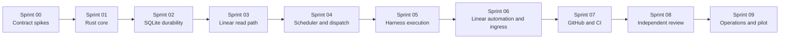

# AI Harness Orchestrator Sprint Plan

**Last Verified:** 2026-07-28  
**Status:** Implementation-ready plan; no application code exists yet  
**Source of truth:** [`../ai_harness_implementation.md`](../ai_harness_implementation.md)

## Purpose

This package turns the architecture and implementation design into an ordered,
testable delivery plan. A sprint is a dependency gate, not a calendar promise.
Teams may timebox the work later, but a sprint is complete only when its exit
criteria are demonstrated.

The target is one Rust orchestrator on an always-on homelab VM, backed by SQLite,
with Cloudflare Tunnel ingress. Linear supplies readiness, repository context, and a
complexity estimate. Versioned dispatch rules select `(harness, model, effort)`.
Codex or Claude Code implements; a fresh different harness reviews after CI.

## Non-negotiable invariants

- The domain and application layers import no Linear, GitHub, SQLx, Axum, systemd,
  Codex, or Claude implementation packages.
- SQLite is the single-node consistency boundary.
- Webhooks accelerate the workflow; reconciliation establishes eventual
  correctness.
- A ticket supplies complexity, not harness/model configuration.
- Every dispatch decision records policy version, rule, candidates, skips, and
  selection.
- The configurable pilot limits are three total active harness workloads and one
  AI-initiated workload.
- A mutating harness becomes sticky after successful launch.
- Review uses fresh context and a different harness from the sticky maker.
- Capacity failures never consume engineering correction rounds.
- Harness credentials cannot merge.
- External writes are delivered from an outbox and are idempotent.
- No work in this plan requires reading or migrating `LEGACY/`.

## Sprint sequence

| Sprint | Outcome | Production writes enabled? |
|---|---|---:|
| [00 — Contract and feasibility spikes](00-contract-and-feasibility.md) | Unknown external behavior becomes fixtures and decisions | No |
| [01 — Rust foundation and domain](01-rust-foundation-and-domain.md) | Compiling service skeleton and pure policy model | No |
| [02 — SQLite durability](02-sqlite-durability.md) | Transactional inbox, outbox, runs, leases, and recovery | No |
| [03 — Linear read path](03-linear-read-path.md) | Canonical issue ingestion and dry-run reconciliation | No |
| [04 — Scheduler and dispatch](04-scheduler-and-dispatch.md) | Deterministic claims, routing, and concurrency control | No |
| [05 — Harness execution](05-harness-execution.md) | Recoverable Codex/Claude runs with capacity classification | Manual-only |
| [06 — Linear automation and ingress](06-linear-automation-and-ingress.md) | Signed webhooks and controlled Linear state projection | Linear only |
| [07 — GitHub and CI](07-github-and-ci.md) | PR/SHA/required-check truth and bounded CI correction | Linear + GitHub |
| [08 — Independent review](08-independent-review.md) | Different-harness maker/checker loop | Linear + GitHub |
| [09 — Operations and pilot](09-operations-and-pilot.md) | Deployable, observable, recoverable pilot | Pilot repositories |

## Shared Definition of Done

Every sprint must satisfy all applicable items:

1. The stated demo runs from documented commands.
2. Unit and integration tests pass with deterministic fixtures.
3. Failure paths are tested, not only happy paths.
4. Database migrations are forward-only and exercised from an empty database.
5. New configuration fails closed with an actionable error.
6. Logs contain correlation IDs and no credentials or raw secret material.
7. External mutations have idempotency keys and reconciliation coverage.
8. Operational behavior after process restart is documented and tested.
9. Unknowns discovered during the sprint are added to the implementation document
   or resolved in an ADR.
10. The next sprint's entry criteria are demonstrably satisfied.

## Cross-sprint artifact contracts

| Artifact | Created | First consumer | Stability rule |
|---|---|---|---|
| Normalized Linear issue fixture | Sprint 00 | Sprint 03 | Version fixture when schema changes |
| Harness capacity fixtures | Sprint 00 | Sprint 05 | Preserve raw redacted events |
| Domain value objects | Sprint 01 | All later sprints | No infrastructure imports |
| SQLite schema | Sprint 02 | Sprints 03–09 | Forward-only migrations |
| `LinearPort` | Sprint 01 | Sprint 03 | Core owns interface |
| Dispatch decision schema | Sprint 02 | Sprint 04 | Immutable audit record |
| `HarnessRunnerPort` | Sprint 01 | Sprint 05 | Provider-neutral result |
| Webhook inbox/outbox | Sprint 02 | Sprints 06–08 | At-least-once and idempotent |
| GitHub canonical facts | Sprint 07 | Sprint 08 | Bind all gates to head SHA |
| Deployment and recovery runbook | Sprint 09 | Operators | Drill after material changes |

## Change-control rules

- A sprint may refine later sprints, but it must not silently weaken an invariant.
- If a spike disproves an adapter assumption, update the architecture and
  implementation documents before implementing around it.
- Dispatch-policy changes increment `policy_version`.
- Database changes receive a new migration; never edit an applied migration.
- Do not enable external writes early merely to make a demo easier.
- Each sprint should be delivered as small reviewable pull requests using the
  suggested slices in its document.

## Evidence Sources

- [`../ai_harness_architecture.md`](../ai_harness_architecture.md)
- [`../ai_harness_implementation.md`](../ai_harness_implementation.md)
- User decisions recorded in those documents on 2026-07-28.
- No implementation code or live deployed service was available when this plan was
  written.
- Nothing inside `LEGACY/` was read.

## Unknown / Unverified

- Sprint duration and staffing are intentionally unspecified.
- Exact Linear estimate scale, model IDs, effort mappings, credentials, repository
  list, and provider reset signals remain Sprint 00 inputs.
- File paths in the sprint documents are target paths, not existing source files.

